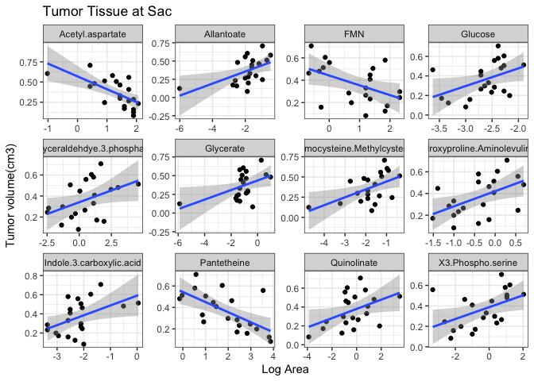
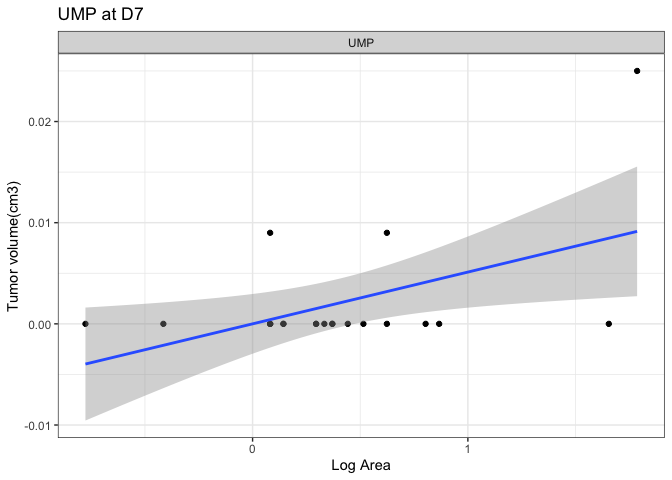
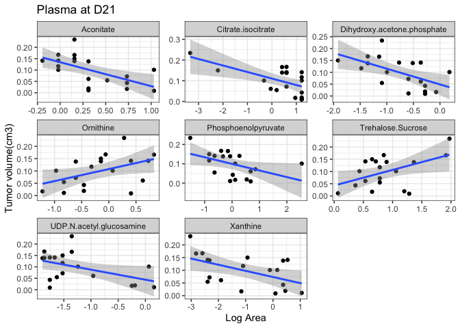
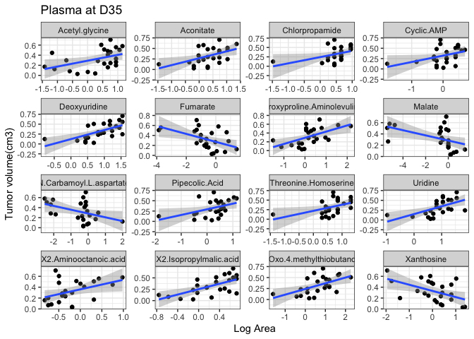

Metabolomics-Tumor Weight Regressions
================
Emily Bean
4/21/2020

This script performs linear regressions on tumor measurements and
metabolite concentrations. Metabolites with a significant regression p
value are
plotted.

### Tumor

### Plasma

