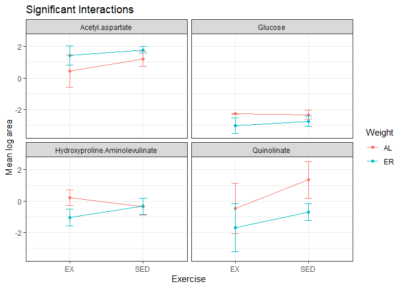
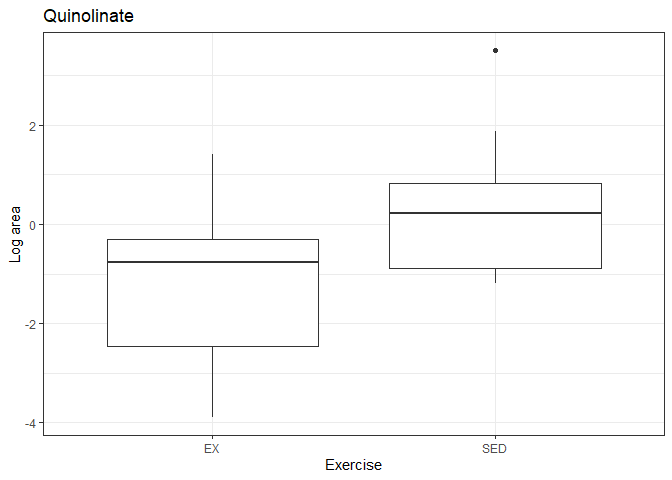
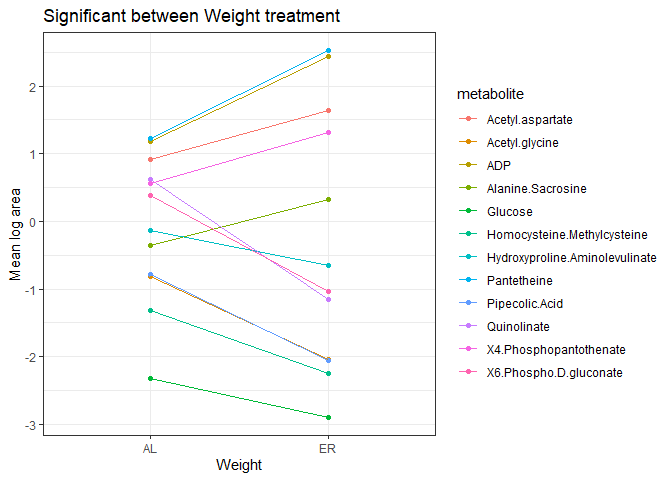
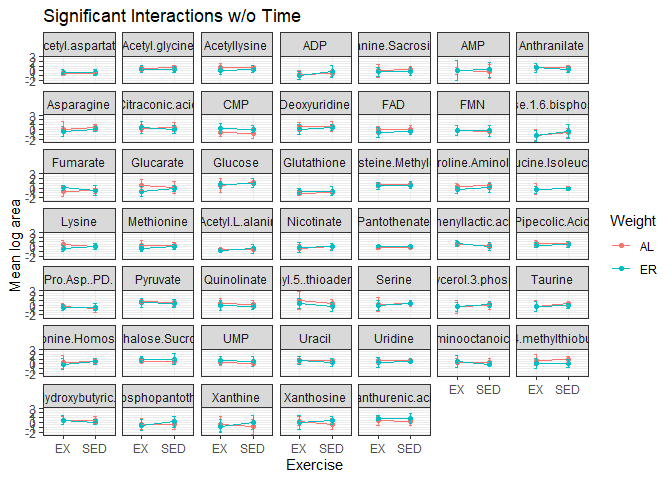
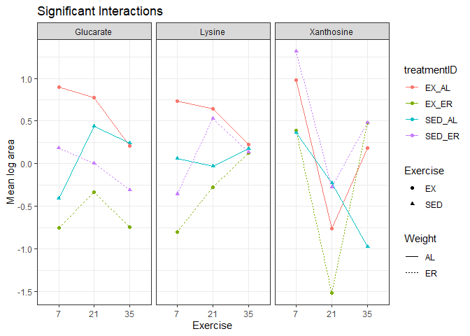

Metabolomics Two-Way ANOVA
================
Emily Bean
April 14, 2020

This script performs a two-way or three-way ANOVA on the aqueous metabolite fraction. Two-way ANOVA compares Exercise, Weight, and the interaction of both treatments. Three-way ANOVA compares Exercise, Weight, Time, and the interaction of both and all three.

Tumor Tissue; Two-way ANOVA
---------------------------

**Table of all F statistics & unadjusted p values**

| metabolite                         |  fStatEx|  pvalEx|  fStatWt|  pvalWt|  fStatInt|  pvalInt|
|:-----------------------------------|--------:|-------:|--------:|-------:|---------:|--------:|
| Pyruvate                           |    0.238|   0.632|    1.993|   0.176|     0.063|    0.805|
| Alanine.Sacrosine                  |    0.897|   0.357|    5.363|   0.033|     0.940|    0.346|
| Lactate                            |    0.043|   0.839|    2.291|   0.149|     0.095|    0.761|
| X2.Oxobutanoate                    |    0.211|   0.652|    1.153|   0.298|     1.134|    0.302|
| Acetoacetate                       |    0.007|   0.932|    1.685|   0.212|     0.026|    0.873|
| X3.Hydroxybutyric.acid             |    0.073|   0.791|    3.617|   0.074|     0.462|    0.506|
| Serine                             |    0.174|   0.682|    1.020|   0.327|     0.037|    0.849|
| Glycerate                          |    0.693|   0.417|    1.804|   0.197|     0.535|    0.474|
| Uracil                             |    0.014|   0.906|    0.819|   0.378|     0.488|    0.494|
| Proline                            |    0.345|   0.565|    0.440|   0.516|     0.196|    0.663|
| Maleic.acid                        |    0.144|   0.709|    0.270|   0.610|     0.481|    0.497|
| Fumarate                           |    0.435|   0.518|    0.022|   0.884|     1.213|    0.286|
| X2.Keto.isovalerate                |    0.270|   0.610|    2.708|   0.118|     0.719|    0.408|
| Acetyl.glycine                     |    0.652|   0.431|    7.000|   0.017|     0.486|    0.495|
| Valine.5.Aminopentanoic.acid       |    0.125|   0.728|    0.812|   0.380|     0.084|    0.775|
| Succinate.Methylmalonic.acid       |    0.813|   0.380|    3.672|   0.072|     1.093|    0.311|
| Threonine.Homoserine               |    0.125|   0.728|    2.315|   0.147|     0.001|    0.973|
| Cysteine                           |    0.188|   0.670|    0.272|   0.609|     0.346|    0.564|
| Nicotinate                         |    0.137|   0.716|    0.264|   0.614|     0.063|    0.805|
| Taurine                            |    0.138|   0.714|    1.782|   0.200|     0.101|    0.755|
| Pyroglutamic.acid                  |    0.539|   0.473|    3.248|   0.089|     0.220|    0.645|
| Pipecolic.Acid                     |    0.361|   0.556|    8.083|   0.011|     0.016|    0.900|
| Citraconic.acid                    |    0.319|   0.580|    1.841|   0.193|     0.900|    0.356|
| Ketoleucine                        |    0.275|   0.607|    2.727|   0.117|     0.266|    0.613|
| Hydroxyproline.Aminolevulinate     |    0.319|   0.579|    4.985|   0.039|     7.795|    0.013|
| N.Acetyl.L.alanine                 |    0.131|   0.722|    2.609|   0.125|     0.043|    0.838|
| Leucine.Isoleucine                 |    0.265|   0.613|    1.716|   0.208|     0.168|    0.687|
| Asparagine                         |    0.057|   0.815|    1.200|   0.289|     0.026|    0.875|
| Hydroxyisocaproic.acid             |    0.147|   0.706|    3.274|   0.088|     0.225|    0.641|
| Ornithine                          |    0.007|   0.936|    0.638|   0.435|     0.633|    0.437|
| Malate                             |    0.075|   0.787|    1.908|   0.185|     0.044|    0.835|
| Homocysteine.Methylcysteine        |    0.022|   0.883|    5.697|   0.029|     0.053|    0.821|
| Anthranilate                       |    0.043|   0.839|    3.799|   0.068|     0.691|    0.417|
| Acetylphosphate                    |    0.422|   0.525|    2.226|   0.154|     4.049|    0.060|
| Alpha.ketoglutarate                |    0.004|   0.952|    0.077|   0.785|     0.025|    0.875|
| Glutamine                          |    0.144|   0.709|    1.463|   0.243|     0.043|    0.838|
| Lysine                             |    0.393|   0.539|    0.415|   0.528|     0.001|    0.973|
| X2.Oxo.4.methylthiobutanoate       |    0.000|   0.995|    0.731|   0.404|     0.000|    0.995|
| Methionine                         |    0.001|   0.976|    0.603|   0.448|     0.579|    0.457|
| Ribose                             |    0.040|   0.843|    2.931|   0.105|     0.185|    0.673|
| X3.Methylphenylacetic.acid         |    0.031|   0.862|    2.845|   0.110|     0.207|    0.655|
| Xanthine                           |    0.083|   0.777|    1.534|   0.232|     0.018|    0.895|
| Hydroxyphenylacetic.acid           |    0.660|   0.428|    1.485|   0.240|     0.956|    0.342|
| X2.3.Dihydroxybenzoic.acid         |    0.213|   0.650|    1.829|   0.194|     0.385|    0.543|
| Histidine                          |    0.407|   0.532|    1.297|   0.270|     0.124|    0.729|
| X2.Aminooctanoic.acid              |    0.032|   0.859|    1.899|   0.186|     0.187|    0.671|
| Indole.3.carboxylic.acid           |    0.061|   0.808|    3.673|   0.072|     0.560|    0.465|
| Phenylpyruvate                     |    0.341|   0.567|    0.058|   0.812|     0.732|    0.404|
| Phenylalanine                      |    0.039|   0.845|    1.789|   0.199|     0.000|    0.990|
| Phenyllactic.acid                  |    0.547|   0.470|    1.868|   0.190|     0.410|    0.530|
| Quinolinate                        |    7.556|   0.014|    9.960|   0.006|     0.604|    0.448|
| Phosphoenolpyruvate                |    0.883|   0.361|    0.606|   0.447|     0.001|    0.972|
| Uric.acid                          |    0.447|   0.513|    1.303|   0.269|     1.693|    0.211|
| Dihydroxy.acetone.phosphate        |    0.130|   0.723|    0.265|   0.613|     0.225|    0.641|
| Glyceraldehdye.3.phosphate         |    0.423|   0.524|    1.205|   0.288|     1.090|    0.311|
| sn.Glycerol.3.phosphate            |    0.080|   0.781|    0.007|   0.937|     0.349|    0.562|
| Aconitate                          |    0.123|   0.730|    1.210|   0.287|     0.003|    0.957|
| N.Acetyl.L.ornithine               |    1.833|   0.194|    2.637|   0.123|     0.537|    0.474|
| Arginine                           |    0.000|   0.985|    2.837|   0.110|     2.639|    0.123|
| Acetyl.aspartate                   |    3.656|   0.073|    8.518|   0.010|     0.646|    0.433|
| Citrulline                         |    0.495|   0.491|    1.563|   0.228|     5.160|    0.036|
| Ascorbic.acid                      |    0.115|   0.739|    0.560|   0.465|     0.020|    0.890|
| N.Carbamoyl.L.aspartate            |    1.165|   0.296|    0.363|   0.555|     0.471|    0.502|
| Allantoate                         |    0.182|   0.675|    4.390|   0.051|     2.405|    0.139|
| X2.Isopropylmalic.acid             |    0.087|   0.772|    2.106|   0.165|     0.231|    0.637|
| Glucono.\_.lactone                 |    0.411|   0.530|    1.652|   0.216|     0.251|    0.623|
| Hydroxyphenylpyruvate              |    0.026|   0.874|    0.044|   0.836|     0.110|    0.744|
| Glucose                            |    1.081|   0.313|   14.547|   0.001|     1.432|    0.248|
| X4.Pyridoxic.acid                  |    0.140|   0.712|    1.304|   0.269|     0.216|    0.648|
| X3.Phospho.serine                  |    0.028|   0.868|    2.581|   0.127|     0.013|    0.912|
| X3.Phosphoglycerate                |    0.002|   0.965|    1.492|   0.239|     1.079|    0.314|
| N.Acetyl.glutamine                 |    0.873|   0.363|    2.903|   0.107|     0.169|    0.687|
| Acetyllysine                       |    0.030|   0.865|    0.219|   0.645|     0.449|    0.512|
| Kynurenic.acid                     |    0.024|   0.878|    0.942|   0.345|     1.361|    0.259|
| N.Acetyl.glutamate                 |    0.054|   0.819|    1.039|   0.322|     0.474|    0.500|
| Citrate.isocitrate                 |    0.642|   0.434|    0.060|   0.809|     0.836|    0.373|
| X2.Keto.D.gluconate                |    0.009|   0.926|    1.420|   0.250|     0.003|    0.958|
| Erythrose.4.phosphate              |    0.000|   0.990|    1.497|   0.238|     0.072|    0.791|
| Tryptophan                         |    0.196|   0.664|    0.551|   0.468|     0.144|    0.709|
| Xanthurenic.acid                   |    0.001|   0.972|    0.822|   0.377|     0.384|    0.544|
| Glucarate                          |    2.708|   0.118|    0.015|   0.902|     0.709|    0.411|
| Deoxyribose.phosphate              |    1.156|   0.297|    0.576|   0.458|     0.411|    0.530|
| Pantothenate                       |    0.142|   0.711|    0.050|   0.825|     0.207|    0.655|
| Cystathionine                      |    3.537|   0.077|    2.294|   0.148|     0.653|    0.430|
| Deoxyuridine                       |    0.011|   0.917|    0.032|   0.860|     0.161|    0.693|
| Ribulose.5.phosphate               |    0.986|   0.335|    0.211|   0.652|     0.040|    0.844|
| Ribose.5.phosphate                 |    0.410|   0.531|    2.378|   0.141|     0.010|    0.923|
| Pro.Asp..PD.                       |    0.625|   0.440|    0.846|   0.370|     0.201|    0.659|
| Val.Asp..VD.                       |    0.001|   0.980|    0.749|   0.399|     0.443|    0.515|
| Uridine                            |    0.063|   0.805|    0.137|   0.716|     0.132|    0.720|
| Leu.Asp..LD.                       |    0.040|   0.845|    1.623|   0.220|     0.309|    0.585|
| Glucosamine.1.6.phosphate          |    1.960|   0.179|    0.685|   0.419|     0.130|    0.723|
| Glucose.1.6.phosphate              |    0.122|   0.731|    1.675|   0.213|     0.058|    0.812|
| Fructose.6.phosphate               |    0.091|   0.767|    2.279|   0.150|     0.033|    0.859|
| Inosine                            |    0.026|   0.875|    0.778|   0.390|     1.094|    0.310|
| X6.Phospho.D.gluconate             |    0.036|   0.852|    6.113|   0.024|     0.203|    0.658|
| Chlorpropamide                     |    0.350|   0.562|    2.178|   0.158|     0.067|    0.799|
| Pantetheine                        |    0.055|   0.817|    7.155|   0.016|     0.209|    0.653|
| Xanthosine                         |    0.156|   0.698|    2.812|   0.112|     0.685|    0.419|
| D.Sedoheptulose.1.7.phosphate      |    0.309|   0.585|    1.311|   0.268|     0.651|    0.431|
| S.Methyl.5..thioadenosine          |    0.341|   0.567|    0.022|   0.884|     0.164|    0.691|
| X4.Phosphopantothenate             |    0.345|   0.565|    5.369|   0.033|     0.275|    0.607|
| N.Acetyl.glucosamine.1.6.phosphate |    0.142|   0.711|    0.917|   0.352|     0.128|    0.725|
| dCMP                               |    0.548|   0.469|    1.270|   0.275|     0.000|    0.997|
| Glutathione                        |    0.240|   0.631|    3.203|   0.091|     0.091|    0.766|
| dTMP                               |    0.151|   0.702|    2.577|   0.127|     3.961|    0.063|
| CMP                                |    0.162|   0.692|    1.436|   0.247|     1.535|    0.232|
| UMP                                |    0.033|   0.859|    1.306|   0.269|     0.428|    0.522|
| Cyclic.AMP                         |    0.000|   0.999|    3.191|   0.092|     0.311|    0.584|
| dAMP                               |    0.512|   0.484|    2.666|   0.121|     0.970|    0.339|
| Fructose.1.6.bisphosphate          |    0.026|   0.874|    1.216|   0.286|     0.551|    0.468|
| Trehalose.Sucrose                  |    0.332|   0.572|    0.064|   0.803|     0.378|    0.547|
| AMP                                |    0.952|   0.343|    0.424|   0.524|     1.059|    0.318|
| IMP                                |    0.345|   0.565|    0.011|   0.916|     3.040|    0.099|
| GMP                                |    0.044|   0.836|    1.213|   0.286|     1.949|    0.181|
| Xanthosine.5.phosphate             |    0.065|   0.801|    0.136|   0.717|     0.613|    0.444|
| Sedoheptoluse.bisphosphate         |    0.058|   0.812|    0.980|   0.336|     0.097|    0.759|
| Riboflavin                         |    0.139|   0.714|    1.065|   0.317|     0.602|    0.449|
| S.Adenosyl.L.homocysteine          |    3.160|   0.093|    1.251|   0.279|     0.973|    0.338|
| Octoluse.bisphosphate              |    0.148|   0.706|    0.001|   0.979|     0.586|    0.454|
| CDP                                |    0.380|   0.546|    2.999|   0.101|     0.851|    0.369|
| UDP                                |    0.619|   0.442|    1.582|   0.225|     2.464|    0.135|
| Trehalose.6.Phosphate              |    0.897|   0.357|    0.061|   0.809|     0.706|    0.412|
| ADP                                |    1.672|   0.213|    5.716|   0.029|     1.316|    0.267|
| GDP                                |    0.006|   0.938|    0.000|   0.998|     0.700|    0.414|
| CDP.ethanolamine                   |    0.495|   0.491|    4.292|   0.054|     0.000|    0.986|
| FMN                                |    0.007|   0.933|    0.254|   0.620|     0.101|    0.754|
| X5.Methyl.THF                      |    0.172|   0.683|    0.016|   0.902|     1.533|    0.232|
| UTP                                |    0.057|   0.814|    4.316|   0.053|     0.000|    0.984|
| CDP.choline                        |    0.299|   0.592|    1.052|   0.320|     0.073|    0.791|
| UDP.D.glucose                      |    0.067|   0.799|    1.999|   0.175|     0.162|    0.692|
| UDP.D.glucuronate                  |    0.006|   0.939|    1.351|   0.261|     0.117|    0.736|
| ADP.D.glucose                      |    0.050|   0.825|    0.203|   0.658|     0.095|    0.761|
| UDP.N.acetyl.glucosamine           |    0.353|   0.560|    3.176|   0.093|     0.641|    0.435|
| Glutathione.disulfide              |    0.000|   0.986|    3.521|   0.078|     0.292|    0.596|
| FAD                                |    0.661|   0.427|    1.456|   0.244|     2.987|    0.102|

**Table of significant and adjusted p values from Tukey's post hoc **

| metabolite                     | comparison  | contrast      |  p.adj|
|:-------------------------------|:------------|:--------------|------:|
| Alanine.Sacrosine              | Weight      | ER-AL         |  0.034|
| Acetyl.glycine                 | Weight      | ER-AL         |  0.017|
| Pipecolic.Acid                 | Weight      | ER-AL         |  0.011|
| Hydroxyproline.Aminolevulinate | Weight      | ER-AL         |  0.040|
| Hydroxyproline.Aminolevulinate | Interaction | EX:ER-EX:AL   |  0.011|
| Homocysteine.Methylcysteine    | Weight      | ER-AL         |  0.029|
| Quinolinate                    | Exercise    | SED-EX        |  0.014|
| Quinolinate                    | Weight      | ER-AL         |  0.006|
| Quinolinate                    | Interaction | EX:ER-SED:AL  |  0.004|
| Quinolinate                    | Interaction | SED:ER-SED:AL |  0.045|
| Acetyl.aspartate               | Weight      | ER-AL         |  0.010|
| Acetyl.aspartate               | Interaction | SED:ER-EX:AL  |  0.013|
| Glucose                        | Weight      | ER-AL         |  0.001|
| Glucose                        | Interaction | EX:ER-EX:AL   |  0.016|
| Glucose                        | Interaction | EX:ER-SED:AL  |  0.015|
| X6.Phospho.D.gluconate         | Weight      | ER-AL         |  0.024|
| Pantetheine                    | Weight      | ER-AL         |  0.016|
| X4.Phosphopantothenate         | Weight      | ER-AL         |  0.033|
| ADP                            | Weight      | ER-AL         |  0.029|

**Visualizations**

Plasma; Three-way ANOVA
-----------------------

**Table of all F statistics & p values**

| metabolite                         |  fStatEx|  pvalEx|  fStatWt|  pvalWt|  fStatTime|  pvalTime|  fStatEx\_Wt|  pvalEx\_Wt|  fStatEx\_Time|  pvalEx\_Time|  fStatWt\_Time|  pvalWt\_Time|  fStatEx\_Wt\_Time|  pvalEx\_Wt\_Time|
|:-----------------------------------|--------:|-------:|--------:|-------:|----------:|---------:|------------:|-----------:|--------------:|-------------:|--------------:|-------------:|------------------:|-----------------:|
| Pyruvate                           |    0.502|   0.482|    0.607|   0.439|      4.923|     0.011|        0.404|       0.528|          1.363|         0.265|          3.938|         0.026|              1.668|             0.199|
| Alanine.Sacrosine                  |    0.923|   0.341|    1.842|   0.181|     10.793|     0.000|        0.202|       0.655|          1.746|         0.184|          0.514|         0.601|              1.893|             0.161|
| Lactate                            |    2.007|   0.163|    0.182|   0.671|      0.597|     0.554|        0.221|       0.640|          0.638|         0.532|          1.522|         0.228|              1.535|             0.225|
| X2.Oxobutanoate                    |    0.868|   0.356|    0.090|   0.766|      1.984|     0.148|        1.863|       0.178|          0.795|         0.457|          0.090|         0.914|              0.421|             0.659|
| Acetoacetate                       |    0.013|   0.908|    0.410|   0.525|      2.484|     0.093|        0.923|       0.341|          0.278|         0.759|          0.126|         0.881|              0.287|             0.751|
| X3.Hydroxybutyric.acid             |    0.569|   0.454|    1.008|   0.320|      3.758|     0.030|        0.878|       0.353|          0.294|         0.746|          0.008|         0.992|              0.436|             0.649|
| Serine                             |    3.084|   0.085|    0.286|   0.595|      4.962|     0.011|        0.320|       0.574|          1.237|         0.299|          0.885|         0.419|              2.154|             0.126|
| Glycerate                          |    0.313|   0.579|    0.868|   0.356|      0.084|     0.920|        0.666|       0.418|          0.486|         0.618|          1.773|         0.180|              0.688|             0.507|
| Uracil                             |    0.706|   0.405|    0.637|   0.428|      3.588|     0.035|        0.921|       0.342|          0.013|         0.987|          0.177|         0.838|              0.139|             0.871|
| Proline                            |    0.256|   0.615|    0.044|   0.834|      2.836|     0.068|        0.344|       0.560|          1.241|         0.298|          1.741|         0.185|              1.199|             0.310|
| Maleic.acid                        |    0.983|   0.326|    2.038|   0.159|      3.249|     0.047|        0.697|       0.407|          0.011|         0.990|          0.488|         0.617|              0.693|             0.505|
| Fumarate                           |    2.023|   0.161|    5.899|   0.019|      2.598|     0.084|        3.242|       0.078|          0.016|         0.984|          1.441|         0.246|              1.603|             0.211|
| X2.Keto.isovalerate                |    0.203|   0.654|    0.935|   0.338|      1.958|     0.151|        2.056|       0.158|          0.129|         0.880|          0.466|         0.630|              0.069|             0.933|
| Acetyl.glycine                     |    0.222|   0.639|    3.325|   0.074|      1.862|     0.166|        0.657|       0.421|          3.765|         0.030|          3.936|         0.026|              1.420|             0.251|
| Valine.5.Aminopentanoic.acid       |    0.963|   0.331|    0.001|   0.978|      1.378|     0.261|        0.375|       0.543|          0.665|         0.519|          0.343|         0.711|              1.581|             0.215|
| Succinate.Methylmalonic.acid       |    1.430|   0.237|    0.007|   0.936|      0.785|     0.462|        1.230|       0.273|          0.297|         0.744|          1.434|         0.248|              0.120|             0.888|
| Threonine.Homoserine               |    2.403|   0.127|    1.204|   0.278|      3.332|     0.043|        0.303|       0.584|          1.109|         0.337|          0.261|         0.771|              1.726|             0.188|
| Cysteine                           |    0.055|   0.815|    1.216|   0.275|      0.597|     0.554|        1.080|       0.303|          0.135|         0.874|          2.723|         0.075|              0.505|             0.607|
| Nicotinate                         |    1.178|   0.283|    0.514|   0.477|      4.568|     0.015|        0.525|       0.472|          0.789|         0.460|          1.377|         0.261|              0.761|             0.472|
| Taurine                            |    3.014|   0.088|    1.992|   0.164|      5.368|     0.008|        0.871|       0.355|          0.231|         0.794|          1.387|         0.259|              2.607|             0.083|
| Pyroglutamic.acid                  |    0.349|   0.557|    0.067|   0.797|      0.007|     0.993|        0.061|       0.806|          0.766|         0.470|          1.171|         0.318|              0.189|             0.828|
| Pipecolic.Acid                     |    0.487|   0.488|    3.035|   0.087|      3.582|     0.035|        0.712|       0.402|          0.651|         0.525|          2.525|         0.090|              0.736|             0.484|
| Citraconic.acid                    |    0.095|   0.760|    0.743|   0.393|      4.090|     0.022|        1.454|       0.233|          0.100|         0.905|          0.196|         0.823|              0.245|             0.784|
| Ketoleucine                        |    0.221|   0.640|    0.031|   0.862|      2.654|     0.080|        0.876|       0.354|          0.200|         0.819|          0.288|         0.751|              0.193|             0.825|
| Hydroxyproline.Aminolevulinate     |    4.024|   0.050|    9.502|   0.003|      2.650|     0.080|        0.361|       0.551|          0.288|         0.751|          0.211|         0.811|              1.436|             0.247|
| N.Acetyl.L.alanine                 |    1.328|   0.254|    0.029|   0.866|      5.906|     0.005|        0.609|       0.439|          2.643|         0.081|          0.280|         0.757|              2.894|             0.064|
| Leucine.Isoleucine                 |    1.164|   0.286|    0.532|   0.469|      3.149|     0.051|        0.009|       0.924|          2.981|         0.059|          1.171|         0.318|              2.653|             0.080|
| Asparagine                         |    4.031|   0.050|    2.876|   0.096|      6.163|     0.004|        0.165|       0.686|          1.443|         0.246|          1.108|         0.338|              1.801|             0.175|
| Hydroxyisocaproic.acid             |    1.255|   0.268|    0.016|   0.899|      1.758|     0.183|        0.721|       0.400|          0.126|         0.882|          1.579|         0.216|              0.141|             0.868|
| Ornithine                          |    0.254|   0.616|    0.598|   0.443|      0.188|     0.829|        0.107|       0.745|          0.071|         0.931|          2.844|         0.067|              0.060|             0.941|
| Malate                             |    2.148|   0.149|    2.397|   0.128|      2.280|     0.112|        0.272|       0.604|          0.358|         0.701|          0.045|         0.956|              1.311|             0.278|
| Homocysteine.Methylcysteine        |    0.280|   0.599|    0.893|   0.349|      3.121|     0.052|        0.200|       0.657|          0.509|         0.604|          0.135|         0.874|              1.510|             0.231|
| Anthranilate                       |    0.674|   0.416|    0.804|   0.374|      3.824|     0.028|        1.280|       0.263|          0.044|         0.957|          0.230|         0.795|              0.015|             0.985|
| Acetylphosphate                    |    1.508|   0.225|    0.028|   0.868|      1.721|     0.189|        0.164|       0.687|          0.287|         0.752|          0.124|         0.884|              0.255|             0.776|
| Alpha.ketoglutarate                |    1.098|   0.299|    3.675|   0.061|      3.030|     0.057|        0.120|       0.731|          0.502|         0.608|          0.846|         0.435|              1.421|             0.251|
| Glutamine                          |    1.431|   0.237|    0.707|   0.404|      0.549|     0.581|        0.941|       0.337|          1.404|         0.255|          0.727|         0.488|              1.480|             0.237|
| Lysine                             |    0.299|   0.587|    6.560|   0.013|      1.907|     0.159|        9.283|       0.004|          0.067|         0.936|          4.081|         0.023|              2.119|             0.130|
| X2.Oxo.4.methylthiobutanoate       |    0.328|   0.569|    9.273|   0.004|      1.262|     0.292|        0.001|       0.975|          0.286|         0.753|          0.889|         0.417|              0.879|             0.421|
| Methionine                         |    1.155|   0.288|    3.514|   0.066|      5.671|     0.006|        0.303|       0.585|          0.249|         0.780|          0.245|         0.783|              1.117|             0.335|
| Ribose                             |    1.333|   0.254|    0.204|   0.653|      1.052|     0.357|        0.001|       0.982|          2.272|         0.113|          0.491|         0.615|              1.451|             0.244|
| X3.Methylphenylacetic.acid         |    0.300|   0.586|    0.275|   0.602|      1.859|     0.166|        1.483|       0.229|          1.047|         0.358|          0.493|         0.614|              0.342|             0.712|
| Xanthine                           |    0.163|   0.688|    0.815|   0.371|      3.436|     0.040|        3.601|       0.063|          0.056|         0.946|          0.946|         0.395|              4.050|             0.023|
| Hydroxyphenylacetic.acid           |    1.190|   0.280|    0.014|   0.906|      2.664|     0.079|        0.280|       0.599|          0.039|         0.962|          0.677|         0.513|              0.432|             0.652|
| X2.3.Dihydroxybenzoic.acid         |    0.008|   0.930|    0.011|   0.916|      0.388|     0.680|        0.040|       0.843|          1.485|         0.236|          0.903|         0.411|              0.163|             0.850|
| Histidine                          |    0.357|   0.553|    0.398|   0.531|      1.708|     0.191|        0.199|       0.658|          0.835|         0.440|          0.213|         0.809|              1.716|             0.190|
| X2.Aminooctanoic.acid              |    0.968|   0.330|    0.013|   0.911|      4.467|     0.016|        1.387|       0.244|          0.293|         0.747|          0.447|         0.642|              0.134|             0.875|
| Indole.3.carboxylic.acid           |    0.677|   0.414|    0.713|   0.402|      0.069|     0.933|        0.020|       0.889|          1.108|         0.338|          0.134|         0.875|              0.711|             0.496|
| Phenylpyruvate                     |    0.572|   0.453|    0.003|   0.956|      1.321|     0.276|        2.188|       0.145|          0.268|         0.766|          0.497|         0.611|              0.939|             0.398|
| Phenylalanine                      |    0.017|   0.897|    2.220|   0.142|      1.924|     0.156|        3.351|       0.073|          0.708|         0.497|          0.295|         0.746|              1.294|             0.283|
| Phenyllactic.acid                  |    7.810|   0.007|    0.052|   0.821|      0.070|     0.932|        3.705|       0.060|          1.822|         0.172|          1.105|         0.339|              0.686|             0.508|
| Quinolinate                        |    0.553|   0.460|    4.784|   0.033|      0.695|     0.503|        0.000|       0.985|          1.069|         0.351|          1.521|         0.228|              5.884|             0.005|
| Phosphoenolpyruvate                |    0.015|   0.902|    1.084|   0.303|      0.147|     0.864|        0.502|       0.482|          0.020|         0.980|          2.622|         0.082|              1.350|             0.268|
| Uric.acid                          |    0.585|   0.448|    0.153|   0.698|      2.427|     0.098|        0.011|       0.916|          0.190|         0.827|          0.330|         0.721|              1.133|             0.330|
| Dihydroxy.acetone.phosphate        |    0.024|   0.877|    1.268|   0.265|      1.782|     0.178|        0.121|       0.729|          0.303|         0.740|          0.873|         0.424|              1.810|             0.174|
| Glyceraldehdye.3.phosphate         |    0.509|   0.479|    2.137|   0.150|      0.454|     0.637|        0.239|       0.627|          0.404|         0.670|          0.116|         0.891|              0.501|             0.609|
| sn.Glycerol.3.phosphate            |    2.315|   0.134|    0.436|   0.512|      4.561|     0.015|        0.199|       0.657|          2.389|         0.102|          0.642|         0.530|              1.453|             0.243|
| Aconitate                          |    3.115|   0.083|    0.030|   0.863|      0.050|     0.952|        0.170|       0.681|          0.536|         0.588|          3.560|         0.036|              0.188|             0.829|
| N.Acetyl.L.ornithine               |    0.392|   0.534|    1.384|   0.245|      0.063|     0.939|        2.867|       0.096|          1.013|         0.370|          0.004|         0.996|              0.906|             0.410|
| Arginine                           |    1.942|   0.169|    2.810|   0.100|      0.694|     0.504|        2.900|       0.095|          0.278|         0.758|          0.801|         0.454|              2.774|             0.072|
| Acetyl.aspartate                   |    0.664|   0.419|    6.131|   0.017|      1.375|     0.262|        0.166|       0.685|          0.049|         0.952|          3.332|         0.043|              0.199|             0.820|
| Citrulline                         |    1.068|   0.306|    0.925|   0.341|      1.114|     0.336|        0.018|       0.894|          1.313|         0.278|          0.243|         0.785|              2.135|             0.129|
| Ascorbic.acid                      |    1.056|   0.309|    0.183|   0.670|      0.526|     0.594|        0.054|       0.817|          0.489|         0.616|          1.682|         0.196|              1.376|             0.262|
| N.Carbamoyl.L.aspartate            |    0.057|   0.812|    1.602|   0.211|      0.097|     0.907|        0.052|       0.820|          0.371|         0.692|          0.182|         0.834|              0.045|             0.956|
| Allantoate                         |    0.345|   0.559|    0.293|   0.591|      1.768|     0.181|        0.112|       0.740|          0.064|         0.938|          0.603|         0.551|              0.599|             0.553|
| X2.Isopropylmalic.acid             |    0.007|   0.935|    0.750|   0.390|      2.073|     0.136|        0.387|       0.537|          0.310|         0.734|          0.146|         0.864|              0.359|             0.700|
| Glucono.\_.lactone                 |    0.684|   0.412|    0.560|   0.457|      2.664|     0.079|        0.418|       0.521|          0.459|         0.634|          0.055|         0.946|              0.363|             0.697|
| Hydroxyphenylpyruvate              |    0.005|   0.945|    0.451|   0.505|      2.504|     0.092|        0.843|       0.363|          0.687|         0.508|          0.883|         0.420|              1.201|             0.309|
| Glucose                            |    4.284|   0.043|    0.026|   0.872|      3.108|     0.053|        0.193|       0.662|          2.291|         0.111|          1.481|         0.237|              1.643|             0.203|
| X4.Pyridoxic.acid                  |    3.764|   0.058|    0.392|   0.534|      1.390|     0.258|        0.152|       0.698|          0.135|         0.874|          1.206|         0.308|              1.065|             0.352|
| X3.Phospho.serine                  |    0.734|   0.396|    0.760|   0.387|      1.240|     0.298|        0.019|       0.892|          1.269|         0.290|          1.751|         0.184|              2.157|             0.126|
| X3.Phosphoglycerate                |    0.050|   0.824|    0.024|   0.878|      0.449|     0.641|        0.141|       0.708|          0.248|         0.782|          0.849|         0.434|              0.906|             0.410|
| N.Acetyl.glutamine                 |    1.345|   0.251|    3.078|   0.085|      0.883|     0.419|        0.006|       0.941|          0.013|         0.987|          0.445|         0.643|              0.406|             0.668|
| Acetyllysine                       |    0.912|   0.344|    7.193|   0.010|      0.727|     0.488|        1.124|       0.294|          0.303|         0.740|          0.351|         0.706|              1.859|             0.166|
| Kynurenic.acid                     |    0.231|   0.633|    0.225|   0.637|      0.882|     0.420|        0.086|       0.770|          1.247|         0.296|          0.031|         0.969|              1.381|             0.260|
| N.Acetyl.glutamate                 |    2.145|   0.149|    1.167|   0.285|      0.742|     0.481|        0.479|       0.492|          0.826|         0.444|          2.855|         0.067|              0.520|             0.598|
| Citrate.isocitrate                 |    0.335|   0.565|    1.023|   0.316|      1.511|     0.230|        0.156|       0.695|          0.151|         0.860|          1.540|         0.224|              1.489|             0.235|
| X2.Keto.D.gluconate                |    3.086|   0.085|    0.084|   0.774|      1.877|     0.163|        0.015|       0.904|          0.869|         0.425|          0.213|         0.809|              0.364|             0.697|
| Erythrose.4.phosphate              |    0.042|   0.838|    1.083|   0.303|      1.186|     0.313|        0.586|       0.447|          0.646|         0.528|          0.161|         0.851|              0.047|             0.954|
| Tryptophan                         |    2.045|   0.159|    3.763|   0.058|      0.020|     0.981|        0.835|       0.365|          0.440|         0.647|          0.421|         0.659|              0.782|             0.463|
| Xanthurenic.acid                   |    0.464|   0.499|    5.944|   0.018|      0.484|     0.619|        0.002|       0.969|          0.815|         0.448|          0.197|         0.822|              0.083|             0.920|
| Glucarate                          |    0.376|   0.542|    7.077|   0.010|      0.609|     0.548|        4.053|       0.049|          0.201|         0.819|          0.049|         0.952|              1.161|             0.321|
| Deoxyribose.phosphate              |    2.367|   0.130|    2.265|   0.138|      0.369|     0.693|        0.521|       0.474|          0.774|         0.466|          0.460|         0.634|              2.113|             0.131|
| Pantothenate                       |    0.166|   0.685|    5.245|   0.026|      7.933|     0.001|        0.698|       0.407|          0.180|         0.836|          0.321|         0.727|              1.468|             0.240|
| Cystathionine                      |    2.518|   0.119|    0.229|   0.634|      0.930|     0.401|        0.004|       0.950|          0.834|         0.440|          0.352|         0.705|              1.543|             0.223|
| Deoxyuridine                       |    0.966|   0.330|    2.987|   0.090|      6.524|     0.003|        1.077|       0.304|          1.097|         0.341|          0.182|         0.834|              1.256|             0.293|
| Ribulose.5.phosphate               |    0.427|   0.516|    2.290|   0.136|      3.131|     0.052|        0.074|       0.787|          1.110|         0.337|          0.051|         0.950|              1.753|             0.183|
| Ribose.5.phosphate                 |    0.008|   0.930|    0.040|   0.842|      0.120|     0.887|        0.450|       0.505|          0.108|         0.898|          1.521|         0.228|              1.225|             0.302|
| Pro.Asp..PD.                       |    0.157|   0.694|    0.030|   0.862|      4.805|     0.012|        0.822|       0.369|          2.576|         0.086|          0.788|         0.460|              0.925|             0.403|
| Val.Asp..VD.                       |    1.076|   0.304|    0.096|   0.758|      0.086|     0.918|        0.592|       0.445|          0.512|         0.602|          0.721|         0.491|              0.435|             0.649|
| Uridine                            |    0.740|   0.394|    2.030|   0.160|      3.745|     0.030|        0.871|       0.355|          0.152|         0.859|          0.254|         0.777|              0.352|             0.705|
| Leu.Asp..LD.                       |    1.226|   0.273|    0.022|   0.882|      0.714|     0.494|        0.244|       0.623|          0.887|         0.418|          2.552|         0.088|              0.639|             0.532|
| Glucosamine.1.6.phosphate          |    0.541|   0.465|    0.100|   0.753|      0.627|     0.538|        0.844|       0.362|          0.442|         0.645|          2.136|         0.128|              0.333|             0.718|
| Glucose.1.6.phosphate              |    0.004|   0.951|    2.137|   0.150|      0.881|     0.420|        0.119|       0.732|          0.509|         0.604|          0.234|         0.792|              1.189|             0.313|
| Fructose.6.phosphate               |    0.006|   0.941|    3.232|   0.078|      2.375|     0.103|        0.001|       0.970|          0.221|         0.802|          0.341|         0.713|              0.705|             0.499|
| Inosine                            |    2.557|   0.116|    1.548|   0.219|      0.645|     0.529|        0.022|       0.883|          0.406|         0.668|          0.287|         0.752|              0.872|             0.424|
| X6.Phospho.D.gluconate             |    0.837|   0.364|    0.025|   0.874|      1.695|     0.194|        0.177|       0.676|          1.466|         0.240|          0.833|         0.440|              1.295|             0.283|
| Chlorpropamide                     |    0.001|   0.978|    1.152|   0.288|      0.437|     0.649|        0.793|       0.377|          0.455|         0.637|          0.130|         0.879|              1.540|             0.224|
| Pantetheine                        |    0.324|   0.572|    2.027|   0.161|      0.577|     0.565|        3.611|       0.063|          0.413|         0.664|          0.540|         0.586|              1.029|             0.365|
| Xanthosine                         |    0.008|   0.930|    0.793|   0.377|     10.069|     0.000|        4.921|       0.031|          3.599|         0.034|          2.443|         0.097|              0.220|             0.803|
| D.Sedoheptulose.1.7.phosphate      |    2.795|   0.101|    1.950|   0.168|      1.086|     0.345|        0.052|       0.820|          0.057|         0.945|          0.228|         0.797|              2.523|             0.090|
| S.Methyl.5..thioadenosine          |    2.772|   0.102|    4.481|   0.039|      0.081|     0.922|        0.107|       0.745|          0.239|         0.788|          0.003|         0.997|              0.932|             0.400|
| X4.Phosphopantothenate             |    1.392|   0.243|    0.668|   0.418|      2.824|     0.069|        2.895|       0.095|          3.375|         0.042|          0.545|         0.583|              2.557|             0.087|
| N.Acetyl.glucosamine.1.6.phosphate |    2.492|   0.121|    0.810|   0.372|      2.462|     0.095|        0.062|       0.804|          0.747|         0.479|          0.355|         0.703|              0.947|             0.394|
| dCMP                               |    0.916|   0.343|    2.513|   0.119|      0.718|     0.493|        0.293|       0.591|          1.141|         0.327|          0.806|         0.452|              2.175|             0.124|
| Glutathione                        |    0.011|   0.918|    8.163|   0.006|      0.980|     0.382|        0.118|       0.732|          0.255|         0.776|          0.052|         0.950|              1.322|             0.276|
| dTMP                               |    0.098|   0.756|    0.216|   0.644|      0.383|     0.684|        1.986|       0.165|          1.040|         0.361|          1.761|         0.182|              0.068|             0.934|
| CMP                                |    1.469|   0.231|   10.759|   0.002|      0.734|     0.485|        0.100|       0.753|          0.198|         0.821|          0.264|         0.769|              0.351|             0.706|
| UMP                                |    1.878|   0.176|    5.844|   0.019|      2.065|     0.137|        0.036|       0.850|          1.422|         0.250|          0.183|         0.834|              2.993|             0.059|
| Cyclic.AMP                         |    1.298|   0.260|    0.227|   0.636|      2.431|     0.098|        1.090|       0.301|          0.119|         0.888|          0.422|         0.658|              0.156|             0.856|
| dAMP                               |    0.020|   0.889|    2.208|   0.143|      0.105|     0.901|        0.411|       0.524|          0.594|         0.556|          0.236|         0.790|              0.190|             0.827|
| Fructose.1.6.bisphosphate          |    5.848|   0.019|    0.039|   0.844|      0.337|     0.716|        0.752|       0.390|          1.434|         0.248|          0.436|         0.649|              0.284|             0.754|
| Trehalose.Sucrose                  |    0.005|   0.947|    4.104|   0.048|      0.442|     0.645|        0.047|       0.830|          1.046|         0.359|          0.218|         0.805|              0.165|             0.849|
| AMP                                |    0.023|   0.880|    0.451|   0.505|      3.290|     0.045|        0.222|       0.639|          0.814|         0.449|          2.236|         0.117|              1.000|             0.375|
| IMP                                |    0.078|   0.781|    0.839|   0.364|      0.652|     0.525|        3.034|       0.087|          0.225|         0.800|          0.815|         0.448|              0.157|             0.855|
| GMP                                |    0.547|   0.463|    0.998|   0.322|      0.660|     0.521|        0.185|       0.669|          0.344|         0.710|          0.425|         0.656|              0.746|             0.479|
| Xanthosine.5.phosphate             |    1.475|   0.230|    0.671|   0.416|      1.614|     0.209|        0.045|       0.832|          1.546|         0.223|          1.220|         0.303|              0.723|             0.490|
| Sedoheptoluse.bisphosphate         |    1.859|   0.179|    0.150|   0.700|      0.517|     0.599|        0.909|       0.345|          1.824|         0.172|          1.465|         0.241|              0.680|             0.511|
| Riboflavin                         |    0.906|   0.346|    0.947|   0.335|      0.621|     0.541|        0.668|       0.418|          0.164|         0.849|          1.661|         0.200|              1.793|             0.177|
| S.Adenosyl.L.homocysteine          |    0.893|   0.349|    0.389|   0.536|      1.733|     0.187|        0.105|       0.747|          0.113|         0.893|          1.055|         0.355|              0.231|             0.794|
| Octoluse.bisphosphate              |    1.282|   0.263|    0.069|   0.794|      0.118|     0.889|        0.257|       0.614|          1.158|         0.322|          3.077|         0.055|              1.955|             0.152|
| CDP                                |    0.384|   0.538|    0.187|   0.668|      0.042|     0.959|        0.000|       0.996|          0.898|         0.414|          2.297|         0.111|              1.310|             0.279|
| UDP                                |    1.545|   0.219|    2.661|   0.109|      0.611|     0.547|        0.948|       0.335|          0.021|         0.980|          2.094|         0.134|              1.386|             0.259|
| Trehalose.6.Phosphate              |    0.252|   0.618|    2.184|   0.146|      0.473|     0.626|        0.178|       0.674|          0.650|         0.526|          0.260|         0.772|              0.528|             0.593|
| ADP                                |    5.460|   0.023|    0.528|   0.471|      0.586|     0.560|        1.046|       0.311|          0.572|         0.568|          2.260|         0.115|              0.060|             0.942|
| GDP                                |    0.018|   0.893|    0.056|   0.814|      0.387|     0.681|        0.115|       0.736|          0.107|         0.899|          0.132|         0.876|              0.079|             0.924|
| CDP.ethanolamine                   |    1.893|   0.175|    1.279|   0.263|      2.230|     0.118|        0.005|       0.947|          0.347|         0.709|          1.301|         0.281|              1.118|             0.335|
| FMN                                |    0.139|   0.711|    0.004|   0.949|      4.783|     0.012|        0.062|       0.805|          1.169|         0.319|          0.661|         0.521|              0.459|             0.635|
| X5.Methyl.THF                      |    0.678|   0.414|    1.517|   0.224|      0.067|     0.935|        0.857|       0.359|          0.313|         0.733|          1.906|         0.159|              0.572|             0.568|
| UTP                                |    0.164|   0.687|    0.850|   0.361|      0.084|     0.920|        0.092|       0.763|          0.491|         0.615|          0.361|         0.698|              0.358|             0.701|
| CDP.choline                        |    0.017|   0.897|    0.006|   0.940|      0.107|     0.899|        0.142|       0.708|          0.257|         0.775|          0.437|         0.648|              0.046|             0.955|
| UDP.D.glucose                      |    0.676|   0.415|    0.932|   0.339|      0.945|     0.395|        0.494|       0.485|          0.875|         0.423|          0.139|         0.871|              0.047|             0.954|
| UDP.D.glucuronate                  |    1.006|   0.320|    0.426|   0.517|      0.541|     0.585|        0.575|       0.452|          3.043|         0.056|          0.629|         0.537|              2.082|             0.135|
| ADP.D.glucose                      |    0.000|   1.000|    0.126|   0.724|      0.276|     0.760|        0.105|       0.748|          0.951|         0.393|          1.393|         0.258|              1.965|             0.150|
| UDP.N.acetyl.glucosamine           |    1.101|   0.299|    2.255|   0.139|      2.686|     0.078|        0.282|       0.597|          0.953|         0.392|          0.083|         0.921|              0.143|             0.867|
| Glutathione.disulfide              |    2.313|   0.134|    0.329|   0.569|      0.016|     0.985|        0.061|       0.806|          0.148|         0.863|          0.516|         0.600|              0.757|             0.474|
| FAD                                |    0.507|   0.480|    5.296|   0.025|      1.921|     0.157|        0.002|       0.963|          0.059|         0.943|          0.412|         0.665|              0.095|             0.910|

**Table of significant p values from Tukey's post hoc **

| metabolite                     | comparison | contrast           |  p.adj|
|:-------------------------------|:-----------|:-------------------|------:|
| Pyruvate                       | Time       | 35-21              |  0.012|
| Pyruvate                       | Wt-Time    | ER:35-ER:7         |  0.014|
| Pyruvate                       | Wt-Time    | ER:35-AL:21        |  0.039|
| Pyruvate                       | Wt-Time    | ER:35-ER:21        |  0.011|
| Alanine.Sacrosine              | Time       | 35-7               |  0.000|
| Alanine.Sacrosine              | Time       | 35-21              |  0.010|
| Alanine.Sacrosine              | Ex-Time    | EX:35-EX:7         |  0.001|
| Alanine.Sacrosine              | Ex-Time    | SED:35-EX:7        |  0.015|
| Alanine.Sacrosine              | Ex-Time    | EX:35-EX:21        |  0.026|
| Alanine.Sacrosine              | Wt-Time    | AL:35-AL:7         |  0.023|
| Alanine.Sacrosine              | Wt-Time    | AL:35-ER:7         |  0.008|
| Alanine.Sacrosine              | Wt-Time    | ER:35-ER:7         |  0.036|
| Alanine.Sacrosine              | Wt-Time    | AL:35-ER:21        |  0.022|
| Alanine.Sacrosine              | Ex-Wt-Time | EX:ER:35-EX:ER:21  |  0.027|
| X3.Hydroxybutyric.acid         | Time       | 35-7               |  0.042|
| Serine                         | Time       | 35-7               |  0.008|
| Serine                         | Ex-Time    | EX:35-EX:7         |  0.017|
| Serine                         | Ex-Time    | SED:35-EX:7        |  0.028|
| Uracil                         | Time       | 35-21              |  0.042|
| Fumarate                       | Weight     | ER-AL              |  0.020|
| Fumarate                       | Ex-Wt      | EX:ER-EX:AL        |  0.022|
| Fumarate                       | Wt-Time    | AL:35-ER:7         |  0.045|
| Fumarate                       | Wt-Time    | AL:35-ER:21        |  0.036|
| Fumarate                       | Ex-Wt-Time | EX:AL:35-EX:ER:7   |  0.035|
| Fumarate                       | Ex-Wt-Time | EX:ER:35-EX:AL:35  |  0.021|
| Acetyl.glycine                 | Ex-Time    | EX:35-EX:21        |  0.031|
| Acetyl.glycine                 | Wt-Time    | ER:35-ER:7         |  0.049|
| Acetyl.glycine                 | Wt-Time    | ER:35-AL:35        |  0.022|
| Acetyl.glycine                 | Ex-Wt-Time | EX:ER:35-EX:ER:7   |  0.044|
| Acetyl.glycine                 | Ex-Wt-Time | EX:ER:35-EX:ER:21  |  0.019|
| Acetyl.glycine                 | Ex-Wt-Time | EX:ER:35-SED:AL:35 |  0.026|
| Threonine.Homoserine           | Time       | 35-7               |  0.035|
| Nicotinate                     | Time       | 21-7               |  0.019|
| Nicotinate                     | Time       | 35-21              |  0.048|
| Nicotinate                     | Wt-Time    | AL:21-ER:7         |  0.038|
| Taurine                        | Time       | 35-7               |  0.049|
| Taurine                        | Time       | 35-21              |  0.010|
| Taurine                        | Wt-Time    | AL:35-ER:21        |  0.016|
| Taurine                        | Wt-Time    | ER:35-ER:21        |  0.027|
| Taurine                        | Ex-Wt-Time | SED:AL:35-EX:ER:21 |  0.047|
| Pipecolic.Acid                 | Wt-Time    | ER:35-AL:7         |  0.016|
| Citraconic.acid                | Time       | 35-7               |  0.047|
| Citraconic.acid                | Time       | 35-21              |  0.047|
| Hydroxyproline.Aminolevulinate | Weight     | ER-AL              |  0.004|
| Hydroxyproline.Aminolevulinate | Ex-Wt      | EX:ER-SED:AL       |  0.005|
| Hydroxyproline.Aminolevulinate | Wt-Time    | AL:21-ER:7         |  0.020|
| Hydroxyproline.Aminolevulinate | Wt-Time    | AL:35-ER:7         |  0.030|
| N.Acetyl.L.alanine             | Time       | 35-7               |  0.007|
| N.Acetyl.L.alanine             | Time       | 35-21              |  0.034|
| N.Acetyl.L.alanine             | Ex-Time    | SED:35-EX:7        |  0.014|
| N.Acetyl.L.alanine             | Ex-Time    | SED:35-SED:7       |  0.009|
| N.Acetyl.L.alanine             | Ex-Time    | SED:35-SED:21      |  0.025|
| N.Acetyl.L.alanine             | Ex-Wt-Time | SED:ER:35-EX:AL:7  |  0.042|
| N.Acetyl.L.alanine             | Ex-Wt-Time | SED:ER:35-SED:ER:7 |  0.007|
| Leucine.Isoleucine             | Time       | 35-7               |  0.042|
| Leucine.Isoleucine             | Ex-Time    | SED:35-EX:7        |  0.027|
| Leucine.Isoleucine             | Ex-Wt-Time | EX:AL:21-EX:AL:7   |  0.029|
| Asparagine                     | Exercise   | SED-EX             |  0.050|
| Asparagine                     | Time       | 35-7               |  0.003|
| Asparagine                     | Ex-Time    | SED:21-EX:7        |  0.042|
| Asparagine                     | Ex-Time    | EX:35-EX:7         |  0.007|
| Asparagine                     | Ex-Time    | SED:35-EX:7        |  0.012|
| Homocysteine.Methylcysteine    | Time       | 35-7               |  0.044|
| Anthranilate                   | Time       | 35-21              |  0.048|
| Lysine                         | Weight     | ER-AL              |  0.014|
| Lysine                         | Ex-Wt      | EX:ER-EX:AL        |  0.001|
| Lysine                         | Wt-Time    | ER:7-AL:7          |  0.005|
| Lysine                         | Wt-Time    | AL:21-ER:7         |  0.038|
| Lysine                         | Wt-Time    | AL:35-ER:7         |  0.029|
| Lysine                         | Wt-Time    | ER:35-ER:7         |  0.043|
| Lysine                         | Ex-Wt-Time | EX:ER:7-EX:AL:7    |  0.002|
| Lysine                         | Ex-Wt-Time | EX:AL:21-EX:ER:7   |  0.034|
| Lysine                         | Ex-Wt-Time | SED:ER:21-EX:ER:7  |  0.014|
| X2.Oxo.4.methylthiobutanoate   | Weight     | ER-AL              |  0.004|
| Methionine                     | Time       | 35-7               |  0.012|
| Methionine                     | Time       | 35-21              |  0.023|
| Methionine                     | Ex-Time    | SED:35-EX:7        |  0.036|
| Methionine                     | Wt-Time    | AL:35-ER:21        |  0.035|
| Xanthine                       | Time       | 21-7               |  0.035|
| X2.Aminooctanoic.acid          | Time       | 35-7               |  0.032|
| X2.Aminooctanoic.acid          | Time       | 35-21              |  0.042|
| Phenyllactic.acid              | Exercise   | SED-EX             |  0.007|
| Phenyllactic.acid              | Ex-Wt      | SED:ER-EX:ER       |  0.008|
| Phenyllactic.acid              | Ex-Time    | SED:35-EX:35       |  0.026|
| Phenyllactic.acid              | Ex-Wt-Time | SED:ER:35-EX:ER:35 |  0.015|
| Quinolinate                    | Weight     | ER-AL              |  0.035|
| Quinolinate                    | Ex-Wt-Time | EX:ER:35-EX:ER:21  |  0.035|
| sn.Glycerol.3.phosphate        | Time       | 35-21              |  0.013|
| sn.Glycerol.3.phosphate        | Ex-Time    | EX:21-SED:7        |  0.020|
| sn.Glycerol.3.phosphate        | Ex-Time    | EX:35-EX:21        |  0.028|
| Acetyl.aspartate               | Weight     | ER-AL              |  0.017|
| Acetyl.aspartate               | Wt-Time    | ER:35-AL:21        |  0.040|
| Acetyl.aspartate               | Wt-Time    | ER:35-AL:35        |  0.037|
| Glucose                        | Exercise   | SED-EX             |  0.043|
| Glucose                        | Ex-Time    | SED:21-EX:7        |  0.018|
| Glucose                        | Ex-Time    | EX:35-EX:7         |  0.030|
| Acetyllysine                   | Weight     | ER-AL              |  0.010|
| Xanthurenic.acid               | Weight     | ER-AL              |  0.019|
| Glucarate                      | Weight     | ER-AL              |  0.011|
| Glucarate                      | Ex-Wt      | EX:ER-EX:AL        |  0.009|
| Pantothenate                   | Weight     | ER-AL              |  0.027|
| Pantothenate                   | Time       | 35-7               |  0.002|
| Pantothenate                   | Time       | 35-21              |  0.008|
| Pantothenate                   | Ex-Time    | SED:35-EX:7        |  0.038|
| Pantothenate                   | Wt-Time    | ER:35-AL:7         |  0.007|
| Pantothenate                   | Wt-Time    | ER:35-AL:21        |  0.011|
| Pantothenate                   | Ex-Wt-Time | SED:ER:35-EX:AL:7  |  0.024|
| Deoxyuridine                   | Time       | 35-7               |  0.003|
| Deoxyuridine                   | Wt-Time    | AL:35-ER:7         |  0.007|
| Deoxyuridine                   | Ex-Wt-Time | SED:AL:35-EX:ER:7  |  0.049|
| Pro.Asp..PD.                   | Time       | 35-7               |  0.011|
| Pro.Asp..PD.                   | Ex-Time    | EX:35-SED:7        |  0.024|
| Uridine                        | Time       | 35-7               |  0.033|
| Xanthosine                     | Time       | 21-7               |  0.000|
| Xanthosine                     | Ex-Time    | EX:21-EX:7         |  0.001|
| Xanthosine                     | Ex-Time    | EX:21-SED:7        |  0.001|
| Xanthosine                     | Ex-Time    | EX:35-EX:21        |  0.009|
| Xanthosine                     | Wt-Time    | ER:21-AL:7         |  0.011|
| Xanthosine                     | Wt-Time    | ER:21-ER:7         |  0.004|
| Xanthosine                     | Wt-Time    | ER:35-ER:21        |  0.024|
| Xanthosine                     | Ex-Wt-Time | EX:ER:21-EX:AL:7   |  0.008|
| Xanthosine                     | Ex-Wt-Time | EX:ER:21-SED:ER:7  |  0.003|
| Xanthosine                     | Ex-Wt-Time | SED:AL:35-SED:ER:7 |  0.026|
| Xanthosine                     | Ex-Wt-Time | EX:ER:35-EX:ER:21  |  0.039|
| S.Methyl.5..thioadenosine      | Weight     | ER-AL              |  0.041|
| S.Methyl.5..thioadenosine      | Ex-Wt      | SED:ER-EX:AL       |  0.048|
| X4.Phosphopantothenate         | Ex-Time    | EX:35-SED:21       |  0.017|
| Glutathione                    | Weight     | ER-AL              |  0.007|
| CMP                            | Weight     | ER-AL              |  0.002|
| CMP                            | Ex-Wt      | EX:ER-SED:AL       |  0.016|
| UMP                            | Weight     | ER-AL              |  0.020|
| UMP                            | Wt-Time    | ER:35-AL:21        |  0.041|
| UMP                            | Ex-Wt-Time | EX:ER:35-SED:AL:21 |  0.014|
| Fructose.1.6.bisphosphate      | Exercise   | SED-EX             |  0.019|
| Trehalose.Sucrose              | Weight     | ER-AL              |  0.050|
| AMP                            | Time       | 35-7               |  0.046|
| AMP                            | Wt-Time    | ER:35-ER:7         |  0.029|
| ADP                            | Exercise   | SED-EX             |  0.023|
| FMN                            | Time       | 21-7               |  0.015|
| FAD                            | Weight     | ER-AL              |  0.027|
| FAD                            | Wt-Time    | AL:35-ER:7         |  0.039|

**Interactions without Time**

**Interactions with Ex, Weight, and Time**

