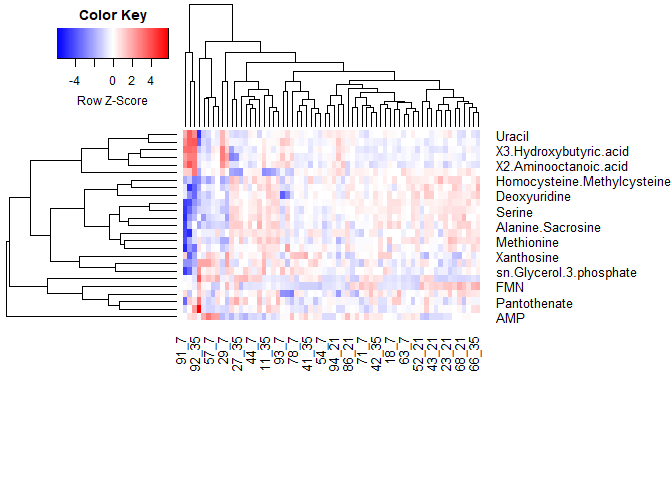
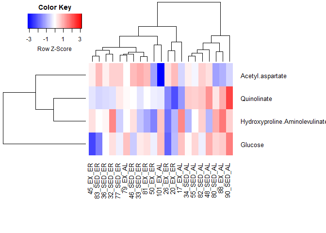
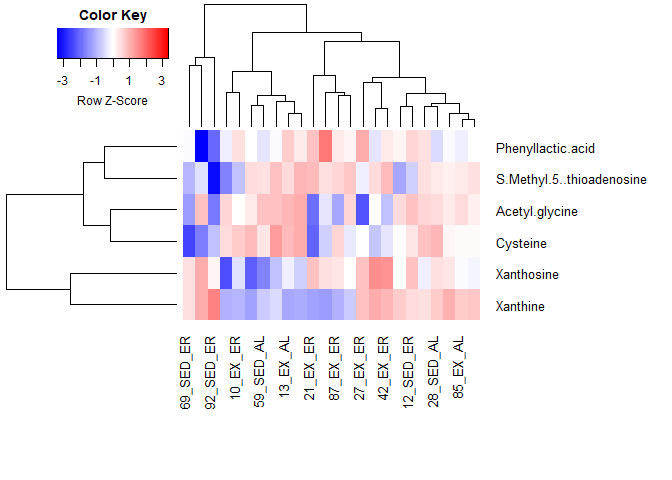
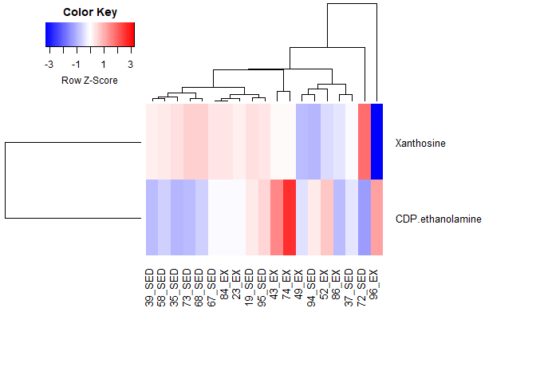
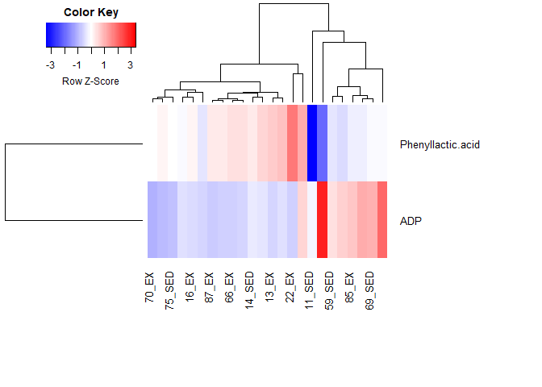
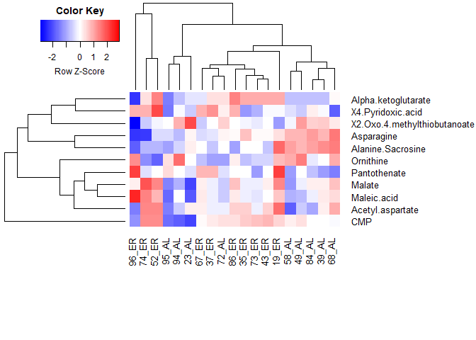

Metabolomics Heatmaps
================
Emily Bean
March 25, 2020

Overview
========

This script makes heatmaps for the metabolites that were found to have significant changes (p &lt; 0.05) in the `metabolomicsAnalysis.md` script.

If many metabolites have significant changes, the first 25 are shown on the heatmap (sorted by F statistic).

Plasma v Tumor
--------------

Plasma D7 v D21 v D35
---------------------

Tumor
-----

### 4 treatment groups

### Exercise vs Sedentary

There is only 1 significant metabolite (Quinolinate) so we can't draw a heatmap.

### Weight gain vs maintenance

Plasma
------

### 4 treatment groups

#### D7

#### D21

#### D35

### Exercise vs Sedentary

#### D7

This also only has 1 significant metabolite.

#### D21

#### D35

### Weight gain vs maintenance

#### D7

#### D21

#### D35

