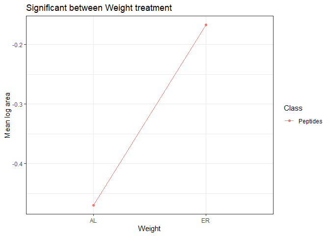
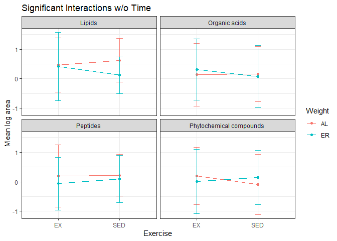
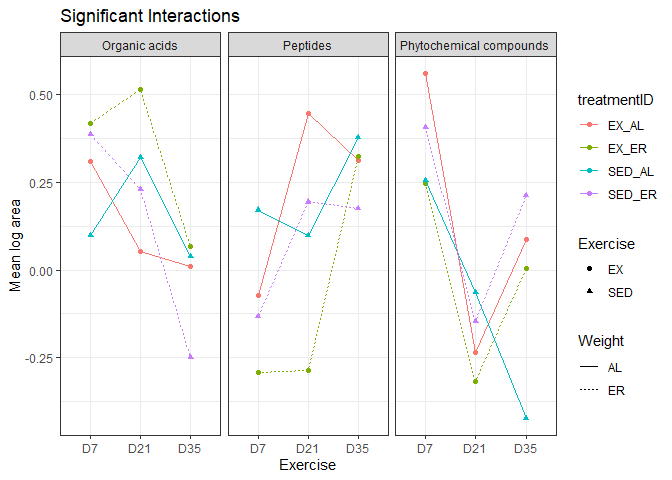

Metabolomics KEGG Orthology
================
Emily Bean
4/24/2020

### Functional orthology from KEGG database

Class compound names were matched to KEGG numbers in MetaboAnalyst, KEGG, or PubChem.

One Class did not match to any KEGG or Pubchem numbers: Octoluse-bisphosphate. This is removed from further analyses in this script.

There are 15 Classs which did not match to KEGG numbers, so they are not included in this analysis.

``` r
require(tidyverse)
```

    ## Loading required package: tidyverse

    ## Warning: package 'tidyverse' was built under R version 3.6.3

    ## -- Attaching packages --------------------------------- tidyverse 1.3.0 --

    ## v ggplot2 3.2.1     v purrr   0.3.3
    ## v tibble  2.1.3     v dplyr   0.8.3
    ## v tidyr   1.0.2     v stringr 1.4.0
    ## v readr   1.3.1     v forcats 0.4.0

    ## -- Conflicts ------------------------------------ tidyverse_conflicts() --
    ## x dplyr::filter() masks stats::filter()
    ## x dplyr::lag()    masks stats::lag()

``` r
require(KEGGREST)
```

    ## Loading required package: KEGGREST

``` r
#BiocManager::install("KEGGREST")
require(omu)
```

    ## Loading required package: omu

    ## Warning: package 'omu' was built under R version 3.6.3

``` r
# set ggplot2 them
ggplot2::theme_set(theme_bw())

# read all aqueous data
aq <- read.table("https://raw.githubusercontent.com/EmilyB17/mice-metab/master/data/allAqueousCleaned.txt", header = TRUE, stringsAsFactors = TRUE) %>% 
  mutate(tissue.type =
           case_when(Label %in% "tumor" ~ "tumor",
                     Label %in% "plasmaD7" ~ "plasma",
                     Label %in% "plasmaD21" ~ "plasma",
                     Label %in% "plasmaD35" ~ "plasma"))

# read data with kegg numbers
keggs <- read.csv("https://github.com/EmilyB17/mice-metab/raw/master/data/kegg.csv", sep = ",", header = TRUE, stringsAsFactors = FALSE) %>% 
  # fix issue with reading KEGG
  mutate(KEGG = str_extract(KEGG, "C(\\d+)")) %>% 
  select(-Comment) %>% 
  # drop the Classs with no KEGG match
  drop_na(KEGG)

# wrangling to put kegg numbers and data together
tomatch <- aq %>% 
  # make unique id considering time and tissue for each mouse
  mutate(id = paste(mouseID, Label, sep = "_")) %>% 
  select(-c(mouseID, tissue.type, Label)) %>% 
  # some text wrangling to get metabolite  names to match up
  mutate(metabolite = 
           str_remove(metabolite , "X")) %>% 
  mutate(metabolite  = str_replace_all(metabolite , "\\.", "-")) %>% 
  mutate(metabolite  = str_remove_all(metabolite , "-$")) %>% 
  mutate(metabolite  = as.character(metabolite ))

# merge
both <- tomatch %>% 
  right_join(keggs, by = c("metabolite" = "Query"))

# format for omu package - need count data and metadata
samps <- both %>% 
  select(id, Match, KEGG, area) %>% 
  pivot_wider(names_from = id, values_from = area, names_prefix = "S") %>% 
  rename(Metabolite = Match)

meta <- both %>% 
  select(id, Exercise, Weight, treatmentID) %>% 
  distinct() %>% 
  mutate(id = paste0("S", id)) 
```

``` r
# get assignment with omu package
assign <- as.data.frame(assign_hierarchy(count_data = samps, keep_unknowns = FALSE, identifier = "KEGG"))
```

    ## Warning: Column `KEGG` joining character vector and factor, coercing into
    ## character vector

``` r
# make vertical for plotting
assignv <- assign %>% 
  pivot_longer(cols = starts_with("S15"), names_to = "id", values_to = "area") %>% 
  left_join(meta, by = "id") %>% 
  mutate(tissue.type = case_when(
    str_detect(id, "tumor") ~ "tumor",
    str_detect(id, "plasma") ~ "plasma"
    ),
    
    Time = case_when(
      tissue.type %in% "plasma" ~ sapply(str_extract(id,  "D(\\d+)"), `[`, 1),
      tissue.type %in% "tumor" ~ "tumor"
    )
  )

# write.table("")
```

``` r
# define a function to perform two-way ANOVA
myTwoWayAnova <- function(df, class) {
  
  
  # make output dataframes
  allpvals <- data.frame()
  posthoc_sigs <- data.frame()
  
  # loop through each Class
  for(i in 1:length(class)) {
    
    # perform ANOVA on the iterated Class
    mod <- aov(area ~ Exercise*Weight, data = filter(df, Class == class[i]))
    
    # collect p values and F statistics
    pvals <- data.frame(Class = class[i],
                        fStatEx =  round(summary(mod)[[1]][["F value"]][1], 3),
                        pvalEx = round(summary(mod)[[1]][["Pr(>F)"]][1], 3),
                        fStatWt = round(summary(mod)[[1]][["F value"]][2], 3),
                        pvalWt = round(summary(mod)[[1]][["Pr(>F)"]][2], 3),
                        fStatInt = round(summary(mod)[[1]][["F value"]][3], 3),
                        pvalInt = round(summary(mod)[[1]][["Pr(>F)"]][3], 3))
    
    # save to an outDF
    allpvals <- rbind(allpvals, pvals)
    
    # perform Tukey post-hoc
    tukey <- TukeyHSD(mod)
    
    # collect p vals
    posthoc <- as.data.frame(rbind(as.data.frame(tukey[1]$Exercise) %>% 
                                     mutate(comparison = "Exercise",
                                            contrast = rownames(tukey[1]$Exercise)),
                                   as.data.frame(tukey[2]$Weight) %>% 
                                     mutate(comparison = "Weight",
                                            contrast = rownames(tukey[2]$Weight)),
                                   as.data.frame(tukey[3]$`Exercise:Weight`) %>% 
                                     mutate(comparison = "Interaction",
                                            contrast = rownames(tukey[3]$`Exercise:Weight`))))
    
    
    # if there are any significant p vals, add to outDF
    if(any(posthoc$`p adj` < 0.05)) {
      
      out <- posthoc %>% filter(`p adj` < 0.05)
      out$Class <- class[i]
      
      posthoc_sigs <- rbind(posthoc_sigs, out)
      
    }
    
    
  }
  
  # return the output dataframes
  return(list(allpvals, posthoc_sigs))
}
```

``` r
# define function to perform three-way ANOVA with Time
myThreeWayAnova <- function(df, class) {
  
  
  # make output dataframes
  allpvals <- data.frame()
  posthoc_sigs <- data.frame()
  
  # loop through each Class
  for(i in 1:length(class)) {
    
    # perform ANOVA on the iterated Class
    mod <- aov(area ~ Exercise*Weight*Time, data = filter(df, Class == class[i]))
    
    # collect p values and F statistics
    pvals <- data.frame(Class = class[i],
                        fStatEx =  round(summary(mod)[[1]][["F value"]][1], 3),
                        pvalEx = round(summary(mod)[[1]][["Pr(>F)"]][1], 3),
                        fStatWt = round(summary(mod)[[1]][["F value"]][2], 3),
                        pvalWt = round(summary(mod)[[1]][["Pr(>F)"]][2], 3),
                        fStatTime = round(summary(mod)[[1]][["F value"]][3], 3),
                        pvalTime = round(summary(mod)[[1]][["Pr(>F)"]][3], 3),
                        fStatEx_Wt = round(summary(mod)[[1]][["F value"]][4], 3),
                        pvalEx_Wt = round(summary(mod)[[1]][["Pr(>F)"]][4], 3),
                        fStatEx_Time = round(summary(mod)[[1]][["F value"]][5], 3),
                        pvalEx_Time = round(summary(mod)[[1]][["Pr(>F)"]][5], 3),
                        fStatWt_Time = round(summary(mod)[[1]][["F value"]][6], 3),
                        pvalWt_Time = round(summary(mod)[[1]][["Pr(>F)"]][6], 3),
                        fStatEx_Wt_Time = round(summary(mod)[[1]][["F value"]][7], 3),
                        pvalEx_Wt_Time = round(summary(mod)[[1]][["Pr(>F)"]][7], 3))
    
    # save to an outDF
    allpvals <- rbind(allpvals, pvals)
    
    # perform Tukey post-hoc
    tukey <- TukeyHSD(mod)
    
    # collect p vals
    posthoc <- as.data.frame(rbind(as.data.frame(tukey[1]$Exercise) %>% 
                                     mutate(comparison = "Exercise",
                                            contrast = rownames(tukey[1]$Exercise)),
                                   as.data.frame(tukey[2]$Weight) %>% 
                                     mutate(comparison = "Weight",
                                            contrast = rownames(tukey[2]$Weight)),
                                   as.data.frame(tukey[3]$Time) %>% 
                                     mutate(comparison = "Time",
                                            contrast = rownames(tukey[3]$Time)),
                                   as.data.frame(tukey[4]$`Exercise:Weight`) %>% 
                                     mutate(comparison = "Ex-Wt",
                                            contrast = rownames(tukey[4]$`Exercise:Weight`)),
                                   as.data.frame(tukey[5]$`Exercise:Time`) %>% 
                                     mutate(comparison = "Ex-Time",
                                            contrast = rownames(tukey[5]$`Exercise:Time`)),
                                   as.data.frame(tukey[6]$`Weight:Time`) %>% 
                                     mutate(comparison = "Wt-Time",
                                            contrast = rownames(tukey[6]$`Weight:Time`)),
                                   as.data.frame(tukey[7]$`Exercise:Weight:Time`) %>% 
                                     mutate(comparison = "Ex-Wt-Time",
                                            contrast = rownames(tukey[7]$`Exercise:Weight:Time`))))
    
    # if there are any significant p vals, add to outDF
    if(any(posthoc$`p adj` < 0.05)) {
      
      out <- posthoc %>% filter(`p adj` < 0.05)
      out$Class <- class[i]
      
      posthoc_sigs <- rbind(posthoc_sigs, out)
      
    }
    
    
  }
  
  # return the output dataframes
  return(list(allpvals, posthoc_sigs))
}
```

### Two-way ANOVA: Exercise, Weight, and Interaction in Tumor Tissue

``` r
df = filter(assignv, tissue.type == "tumor")
tumormod <- myTwoWayAnova(df, 
                          class = unique(df$Class))
```

Only Peptides have significance: between Weight treatment

**Table of all F statistics & unadjusted p values**

```

# print table of all pvalues
#knitr::kable(as.data.frame(tumormod[1]))

# wrangle data for nicer table format
# make table of results

tab <- as.data.frame(tumormod[1]) 

write.table(tab, "C:/Users/emily/OneDrive - The Pennsylvania State University/Research/git/mice-metab/results_tables/aqueous-keggClass-twowayANOVA-fstat_pval.txt", sep = "\t",
            row.names = FALSE)

```

**Table of significant and adjusted p values from Tukey's post hoc **

``` r
# print table of all significant post-hoc findings
sigs <- as.data.frame(tumormod[2]) %>% 
  select(Class = Class, comparison, contrast, p.adj) %>% 
  mutate(p.adj = round(p.adj, 3))

#knitr::kable(sigs)


# wrangle data for nicer table format
# make table of results

#tab <- as.data.frame(tumormod[2]) %>% 
 # select(Class = Class, comparison, contrast, diff, lwr, upr, p.adj)

#write.table(tab, "C:/Users/emily/OneDrive - The Pennsylvania State University/Research/git/mice-metab/results_tables/aqueous-keggClass-twowayANOVA-posthoc.txt", sep = "\t",  row.names = FALSE)
```

**Visualizations**

``` r
## only significance is PEPTIDES: plot
## get Classs with just Weight significance
sigWt <- data.frame(tumormod[2]) %>% 
  filter(comparison == "Weight") 

sigdfWt <- assignv %>% 
  filter(tissue.type == "tumor") %>% 
  semi_join(sigWt, by = c("Class" = "Class")) %>% 
  group_by(Class, Weight) %>% 
  summarize(mean = mean(area),
            sd = sd(area),
            cilow = mean - 1.96*sd,
            cihi = mean + 1.96*sd) %>% 
  ungroup()

# plot
ggplot(data = sigdfWt, aes(x = Weight, y = mean, group =Class, color = Class)) +
  geom_point() +
  geom_line() +
  labs(x = "Weight", y = "Mean log area", title = "Significant between Weight treatment")
```



### Three-way ANOVA: Exercise, Weight, Time, Interaction in Plasma Tissue

``` r
plasmamod <- myThreeWayAnova(df = filter(assignv, tissue.type == "plasma"),
                        class = unique(df$Class))
```

**Table of all F statistics & p values**

```

# print table of all pvalues
#knitr::kable(as.data.frame(plasmamod[1]))

# wrangle data for nicer table format
# make table of results

tab <- as.data.frame(plasmamod[1]) 

write.table(tab, "C:/Users/emily/OneDrive - The Pennsylvania State University/Research/git/mice-metab/results_tables/aqueous-keggClass-threewayANOVA-fstat_pval.txt", sep = "\t",
            row.names = FALSE)
```

**Table of significant p values from Tukey's post hoc **

``` r
# print table of all significant post-hoc findings
sigs <- as.data.frame(plasmamod[2]) %>% 
  select(Class, comparison, contrast, p.adj) %>% 
  mutate(p.adj = round(p.adj, 3))

#knitr::kable(sigs)

# wrangle data for nicer table format
# make table of results

#tab <- as.data.frame(plasmamod[2]) %>%  select(Class, comparison, contrast, diff, lwr, upr, p.adj)

#write.table(tab, "C:/Users/emily/OneDrive - The Pennsylvania State University/Research/git/mice-metab/results_tables/aqueous-keggClass-threewayANOVA-posthoc.txt", sep = "\t",           row.names = FALSE)
```

**Interactions without Time**

``` r
# get Classs with significant interaction term
sigsInt <- data.frame(plasmamod[2]) %>% 
  filter(comparison == "Ex-Wt")

sigdf <- assignv %>% 
  filter(tissue.type == "plasma") %>% 
  semi_join(sigs, by = "Class") %>% 
  group_by(Class, Exercise, Weight) %>% 
  summarize(mean = mean(area),
            sd = sd(area),
            cilow = mean - 1.96*sd,
            cihi = mean + 1.96*sd) %>% 
  ungroup()

# make a plot
ggplot(data = sigdf, aes(x = Exercise, y = mean, group = Weight, color = Weight)) +
  geom_point() +
  geom_line() +
  geom_errorbar(data = sigdf, aes(ymin = mean + sd, ymax = mean - sd), width = .1) +
  facet_wrap(~Class) +
  ggtitle("Significant Interactions w/o Time") +
  labs(x = "Exercise", y = "Mean log area")
```



**Interactions with Ex, Weight, and Time**

``` r
# get significant interactions
sigAll <- as.data.frame(plasmamod[2]) %>% 
  filter(comparison == "Ex-Wt-Time")

sigdf <- assignv %>% 
  filter(tissue.type == "plasma") %>% 
  semi_join(sigAll, by = "Class") %>% 
  group_by(Class, treatmentID, Time, Exercise, Weight) %>% 
  summarize(mean = mean(area),
            sd = sd(area),
            cilow = mean - 1.96*sd,
            cihi = mean + 1.96*sd) %>% 
  ungroup() %>% 
  mutate(Time = factor(Time, ordered = TRUE, levels = c("D7", "D21", "D35")))

# make a plot
ggplot(data = sigdf, aes(x = Time, y = mean, group = treatmentID, color = treatmentID)) +
  geom_point(aes(shape = Exercise)) +
  geom_line(aes(linetype = Weight)) +
  facet_wrap(~Class) +
  ggtitle("Significant Interactions")+
  labs(x = "Exercise", y = "Mean log area")
```


