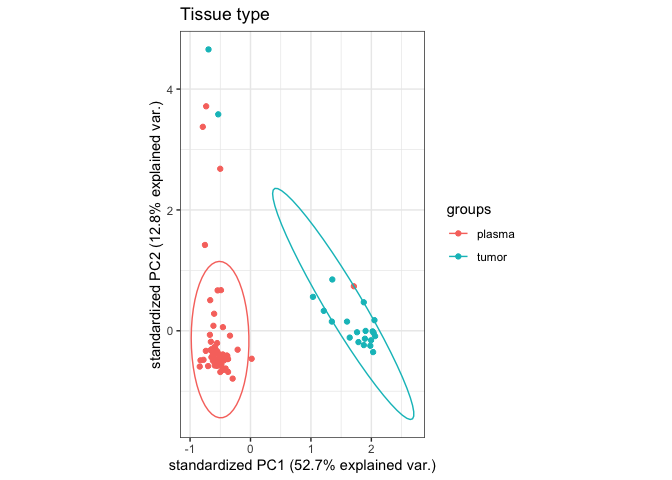
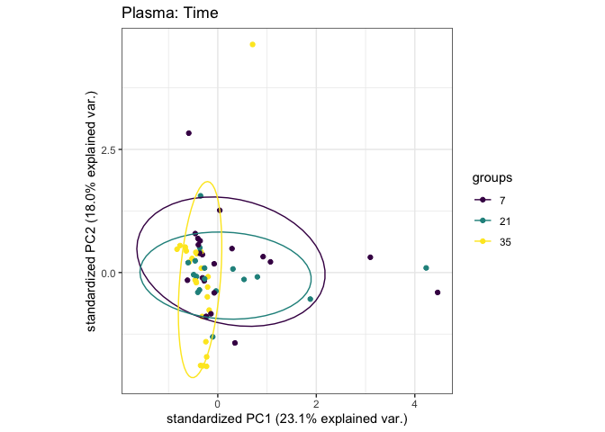
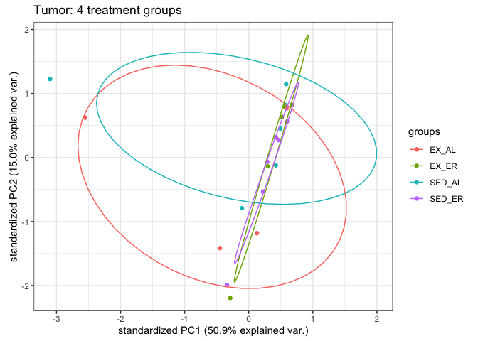
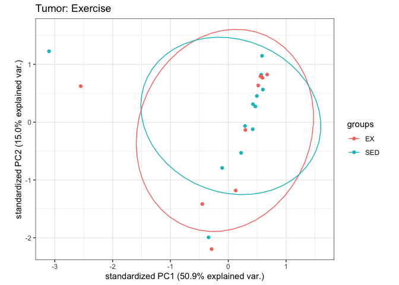
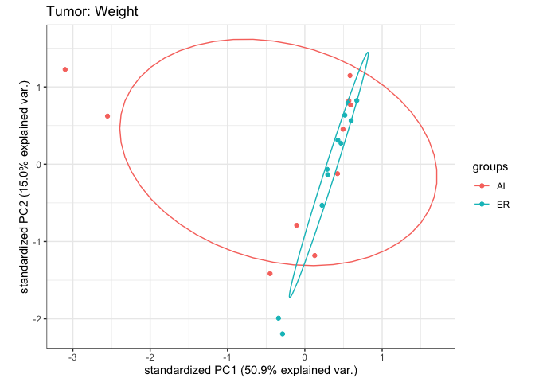
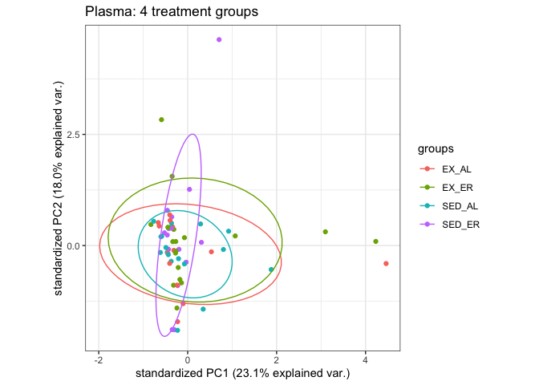
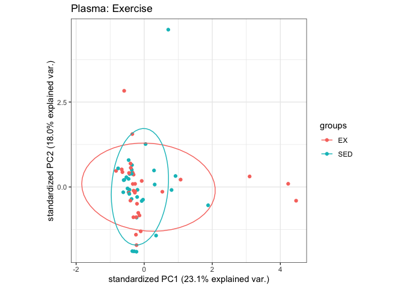
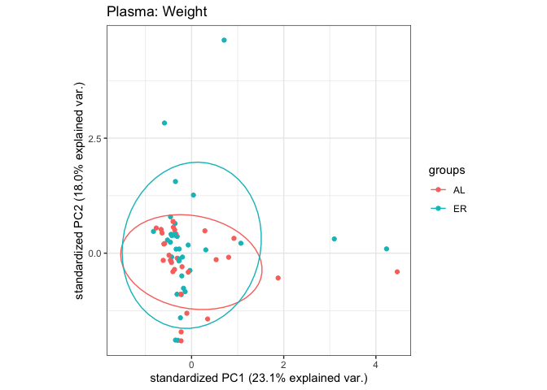

Metabolomics PCA
================
Emily Bean
2/12/2020

# Overview

This script follows the same structure as `metabolmicsAnalysis.Rmd` but
performs a principal components analysis (PCA) on each data subset and
then creates a biplot for visualization.

# Pairwise comparisons

*All comparisons made for both tumor and plasma tissues*

1.  Plasma vs tumor
2.  Plasma D7 vs D21 vd D35  
3.  4 treatment groups (2x2 factorial)  
4.  Exercise vs sedentary  
5.  Weight gain vs weight maintenance

## Plasma vs Tumor

<!-- -->

## Plasma D7 vs D21 vs D35

<!-- -->

## Tumor

### Four Treatment Groups (2x2 factorial)

<!-- -->

### Exercise vs. Sedentary

<!-- -->

### Weight gain vs. weight maintenance

<!-- -->

## Plasma

### Four Treatment Groups (2x2 factorial)

<!-- -->

### Exercise vs. Sedentary

<!-- -->

### Weight gain vs. weight maintenance

<!-- -->
