Lipids PCA by Group
================
Emily Bean
April 14, 2020

This script aggregates the lipidomics dataset by group and performs PCA.

Plasma vs tumor
---------------

### POSITIVE

    ## 
    ##  printing top eigenvalues... 
    ## 
    ##       eigenvalue variance.percent cumulative.variance.percent
    ## Dim.1 13.9669661        58.195692                    58.19569
    ## Dim.2  2.4575929        10.239970                    68.43566
    ## Dim.3  1.5069513         6.278964                    74.71463
    ## Dim.4  1.1390588         4.746078                    79.46070
    ## Dim.5  0.7580423         3.158510                    82.61921
    ## Dim.6  0.6633108         2.763795                    85.38301
    ## [[1]]

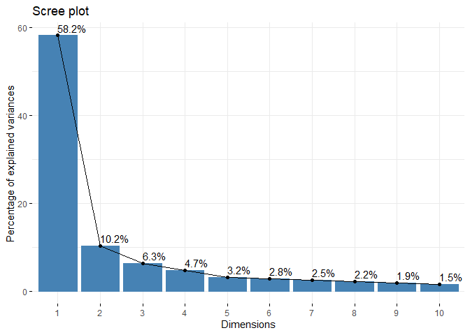

    ## 
    ## [[2]]

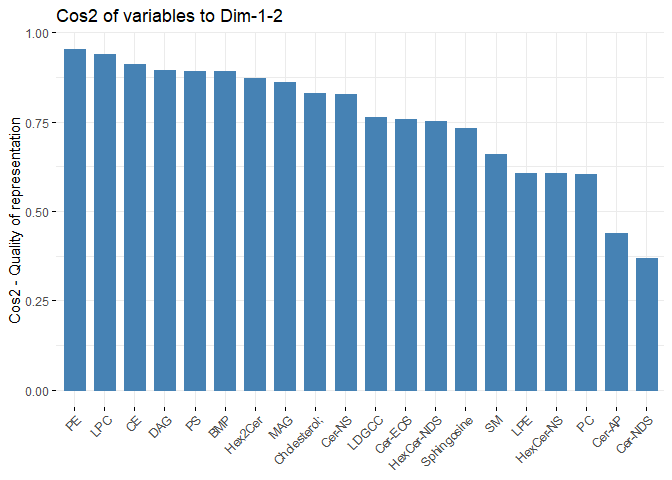

    ## 
    ## [[3]]

    ## 
    ## [[4]]

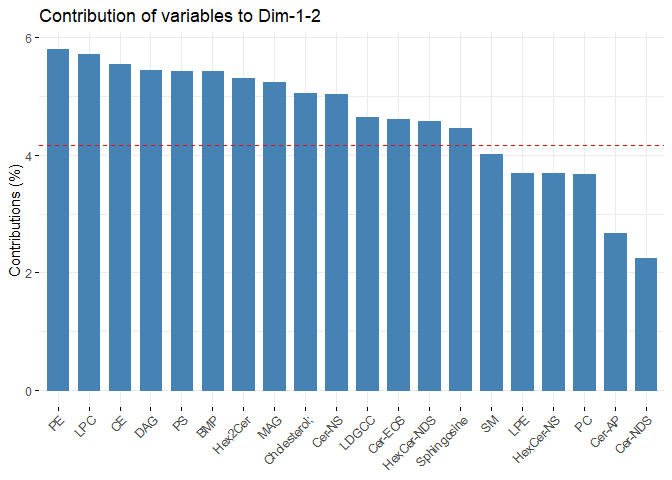

    ## 
    ## [[5]]

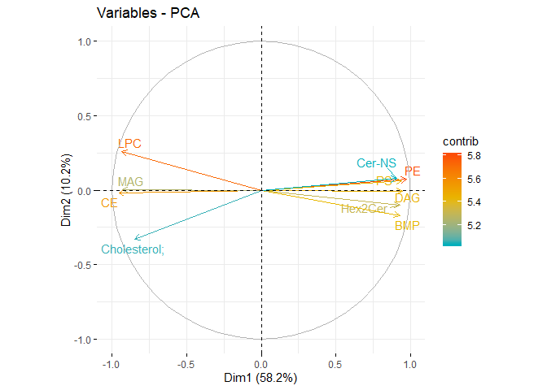

    ## [[1]]

    ## 
    ## [[2]]

### NEGATIVE

    ## 
    ##  printing top eigenvalues... 
    ## 
    ##       eigenvalue variance.percent cumulative.variance.percent
    ## Dim.1  13.528356        32.995991                    32.99599
    ## Dim.2   6.118200        14.922439                    47.91843
    ## Dim.3   2.571287         6.271431                    54.18986
    ## Dim.4   2.131257         5.198188                    59.38805
    ## Dim.5   1.916550         4.674512                    64.06256
    ## Dim.6   1.509536         3.681794                    67.74436
    ## [[1]]

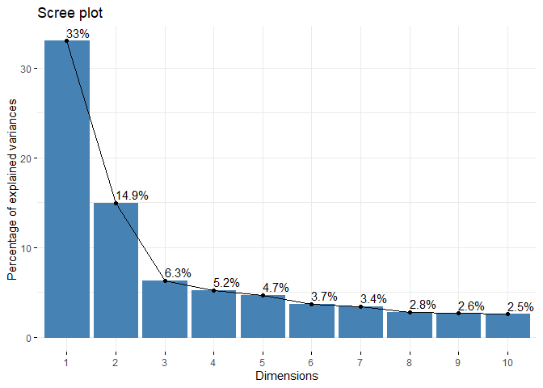

    ## 
    ## [[2]]

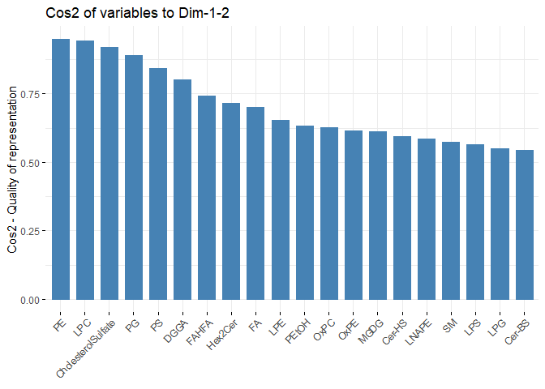

    ## 
    ## [[3]]

    ## 
    ## [[4]]

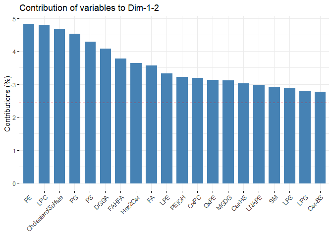

    ## 
    ## [[5]]

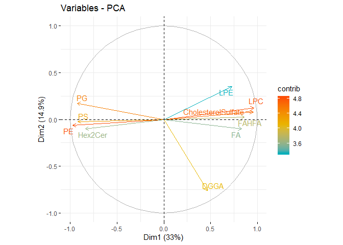

    ## [[1]]

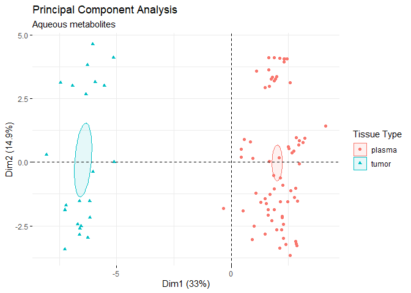

    ## 
    ## [[2]]

Plasma D7 vs D21 vd D35
-----------------------

### POSITIVE

    ## 
    ##  printing top eigenvalues... 
    ## 
    ##       eigenvalue variance.percent cumulative.variance.percent
    ## Dim.1   4.332932        18.053884                    18.05388
    ## Dim.2   2.657987        11.074944                    29.12883
    ## Dim.3   2.190273         9.126139                    38.25497
    ## Dim.4   2.062135         8.592228                    46.84719
    ## Dim.5   1.454265         6.059438                    52.90663
    ## Dim.6   1.290486         5.377024                    58.28366
    ## [[1]]

    ## 
    ## [[2]]

    ## 
    ## [[3]]

    ## 
    ## [[4]]

    ## 
    ## [[5]]

    ## [[1]]

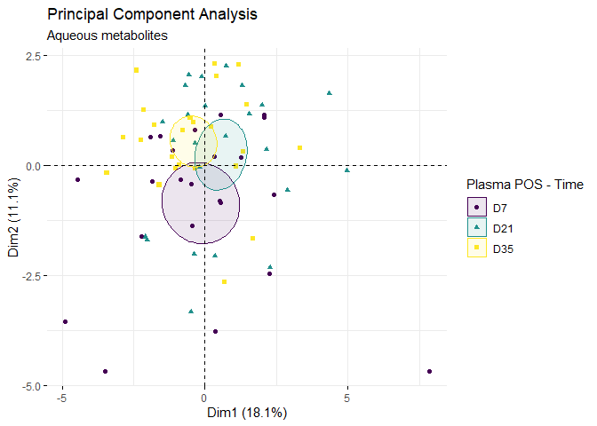

    ## 
    ## [[2]]

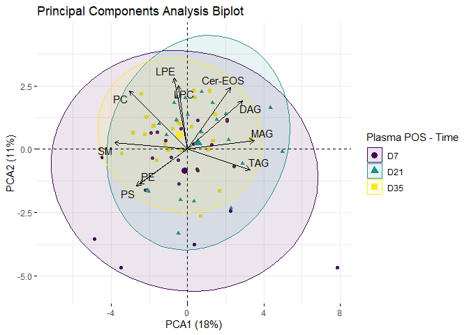

### NEGATIVE

    ## 
    ##  printing top eigenvalues... 
    ## 
    ##       eigenvalue variance.percent cumulative.variance.percent
    ## Dim.1   8.399745        20.487183                    20.48718
    ## Dim.2   4.560872        11.124077                    31.61126
    ## Dim.3   3.630433         8.854714                    40.46597
    ## Dim.4   2.761687         6.735822                    47.20180
    ## Dim.5   2.173479         5.301169                    52.50297
    ## Dim.6   1.783143         4.349130                    56.85210
    ## [[1]]

    ## 
    ## [[2]]

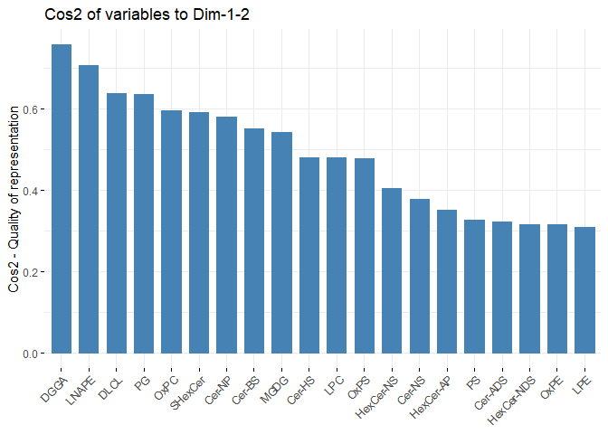

    ## 
    ## [[3]]

    ## 
    ## [[4]]

    ## 
    ## [[5]]

    ## [[1]]

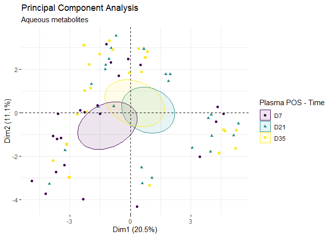

    ## 
    ## [[2]]

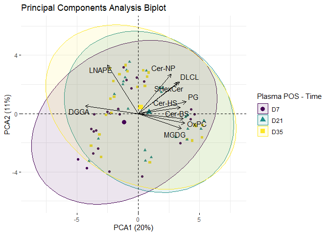

Tumor
-----

### 4 treatment groups (2x2 factorial)

#### POSITIVE

    ## 
    ##  printing top eigenvalues... 
    ## 
    ##       eigenvalue variance.percent cumulative.variance.percent
    ## Dim.1   9.206528        38.360535                    38.36054
    ## Dim.2   3.605653        15.023552                    53.38409
    ## Dim.3   3.052996        12.720816                    66.10490
    ## Dim.4   2.295589         9.564955                    75.66986
    ## Dim.5   1.486766         6.194859                    81.86472
    ## Dim.6   1.122397         4.676654                    86.54137
    ## [[1]]

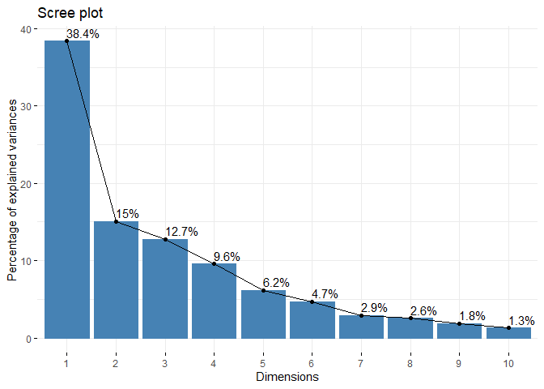

    ## 
    ## [[2]]

    ## 
    ## [[3]]

    ## 
    ## [[4]]

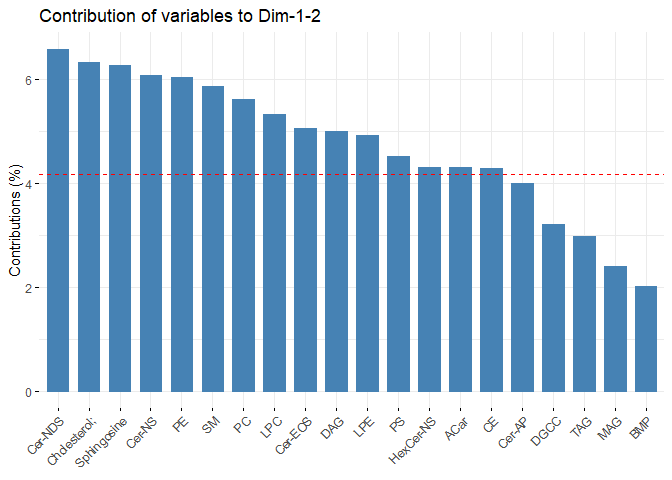

    ## 
    ## [[5]]

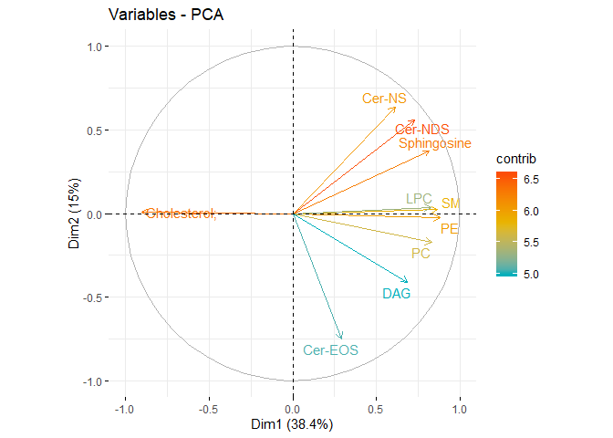

    ## [[1]]

    ## 
    ## [[2]]

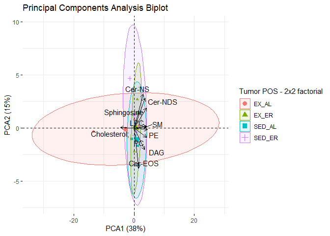

#### NEGATIVE

    ## 
    ##  printing top eigenvalues... 
    ## 
    ##       eigenvalue variance.percent cumulative.variance.percent
    ## Dim.1  11.279723        27.511520                    27.51152
    ## Dim.2   6.283476        15.325551                    42.83707
    ## Dim.3   5.108748        12.460361                    55.29743
    ## Dim.4   3.937240         9.603023                    64.90045
    ## Dim.5   3.022196         7.371209                    72.27166
    ## Dim.6   2.447551         5.969638                    78.24130
    ## [[1]]

    ## 
    ## [[2]]

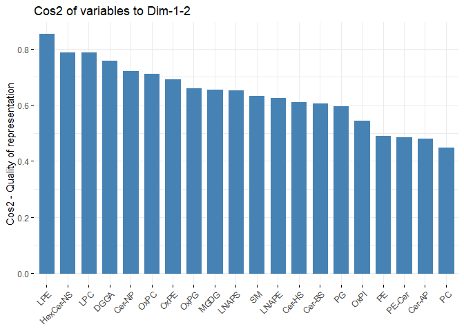

    ## 
    ## [[3]]

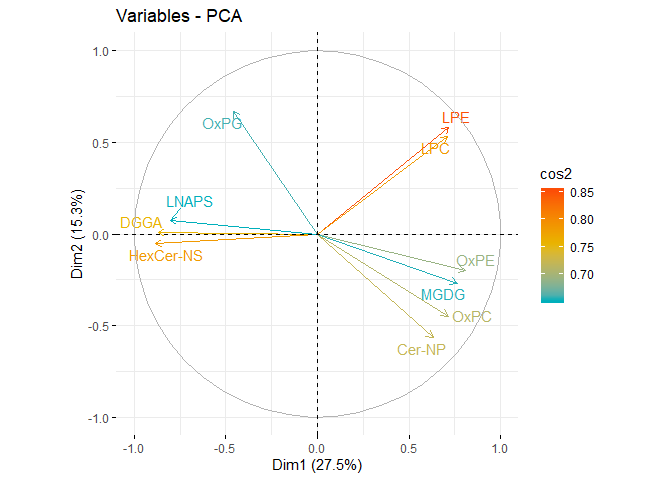

    ## 
    ## [[4]]

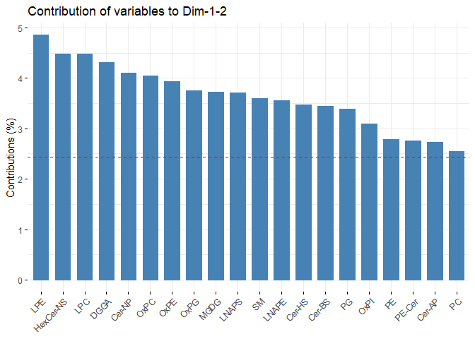

    ## 
    ## [[5]]

    ## [[1]]

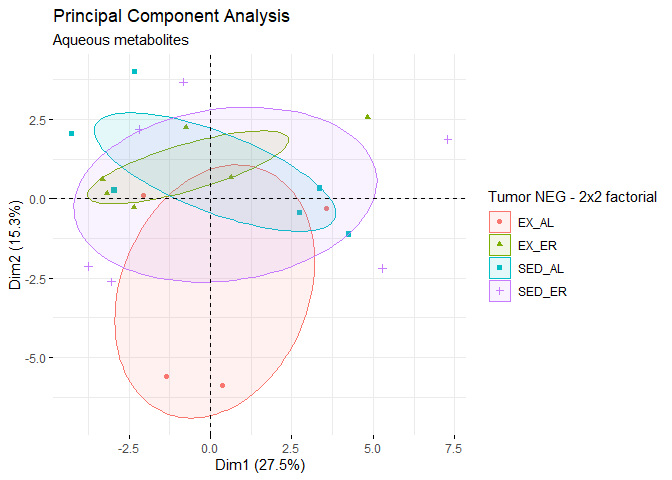

    ## 
    ## [[2]]

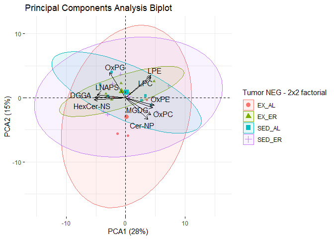

Plasma
------

### 4 treatment groups

#### POSITIVE

    ## 
    ##  printing top eigenvalues... 
    ## 
    ##       eigenvalue variance.percent cumulative.variance.percent
    ## Dim.1   4.332932        18.053884                    18.05388
    ## Dim.2   2.657987        11.074944                    29.12883
    ## Dim.3   2.190273         9.126139                    38.25497
    ## Dim.4   2.062135         8.592228                    46.84719
    ## Dim.5   1.454265         6.059438                    52.90663
    ## Dim.6   1.290486         5.377024                    58.28366
    ## [[1]]

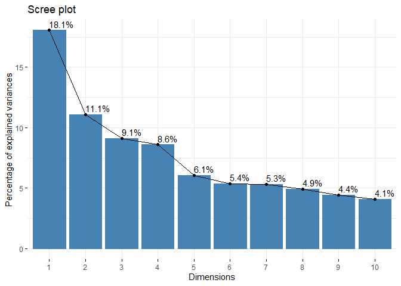

    ## 
    ## [[2]]

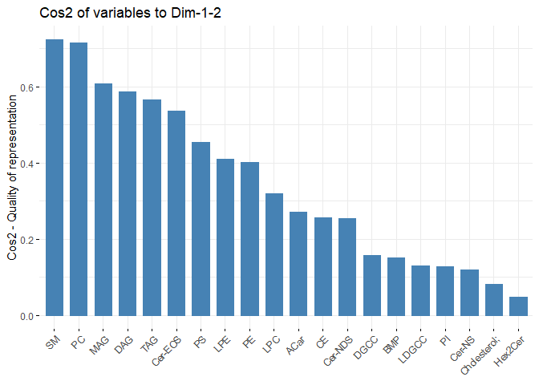

    ## 
    ## [[3]]

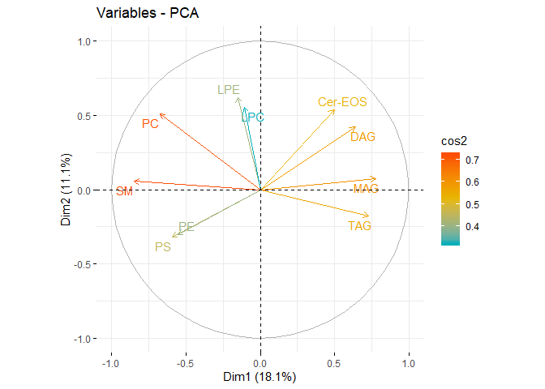

    ## 
    ## [[4]]

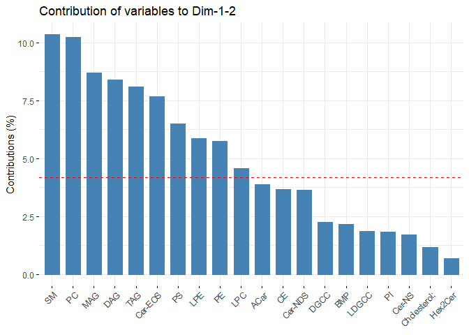

    ## 
    ## [[5]]

    ## [[1]]

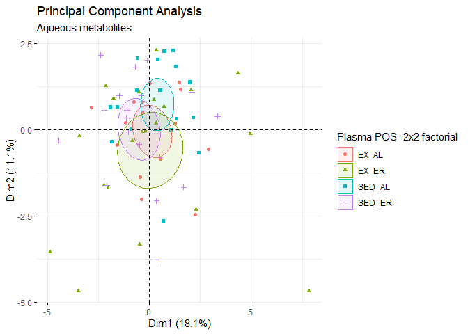

    ## 
    ## [[2]]

#### NEGATIVE

Plasma
------

### 4 treatment groups

    ## 
    ##  printing top eigenvalues... 
    ## 
    ##       eigenvalue variance.percent cumulative.variance.percent
    ## Dim.1   8.399745        20.487183                    20.48718
    ## Dim.2   4.560872        11.124077                    31.61126
    ## Dim.3   3.630433         8.854714                    40.46597
    ## Dim.4   2.761687         6.735822                    47.20180
    ## Dim.5   2.173479         5.301169                    52.50297
    ## Dim.6   1.783143         4.349130                    56.85210
    ## [[1]]

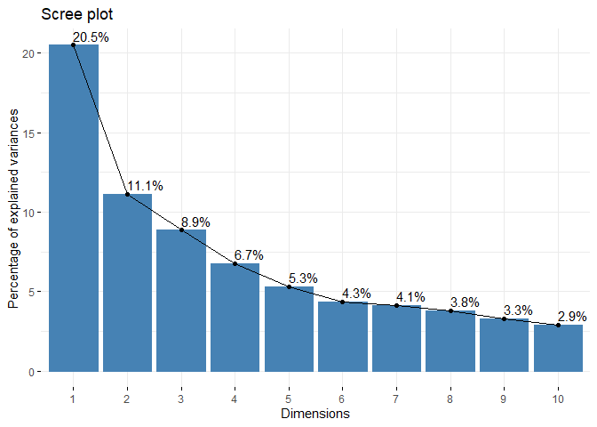

    ## 
    ## [[2]]

    ## 
    ## [[3]]

    ## 
    ## [[4]]

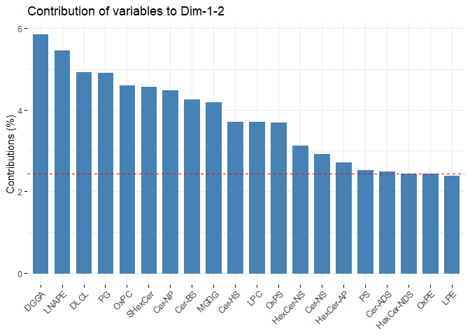

    ## 
    ## [[5]]

    ## [[1]]

    ## 
    ## [[2]]

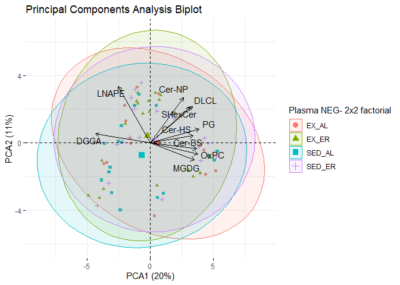
