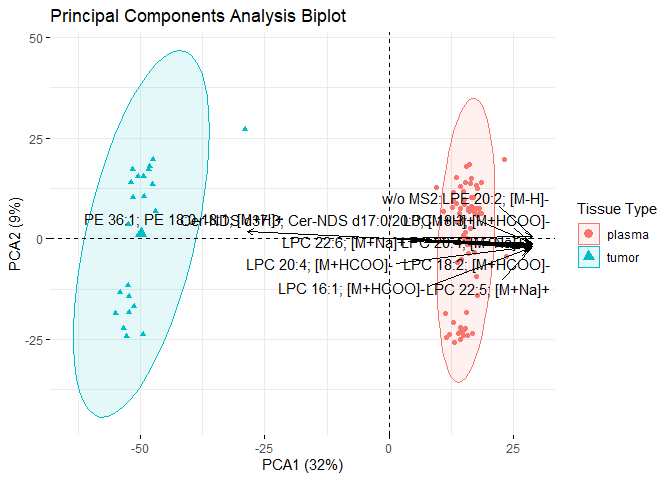
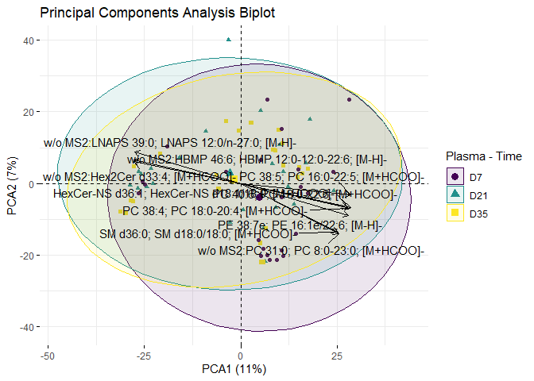
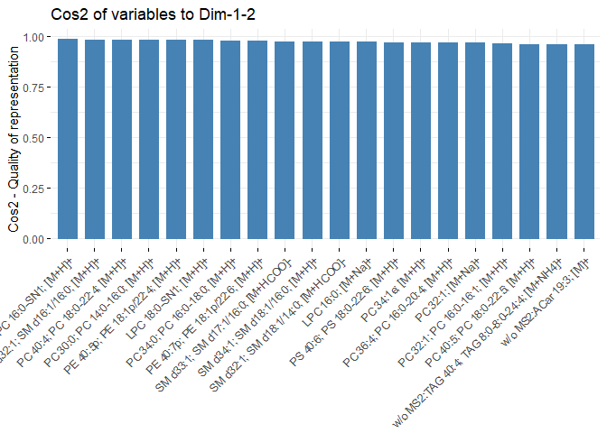
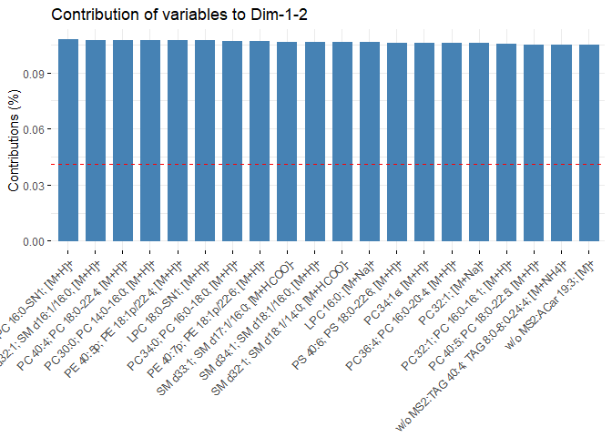
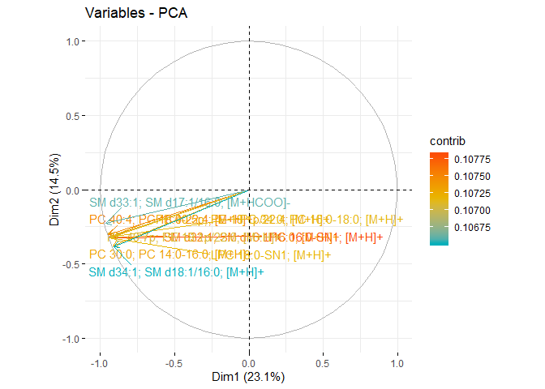
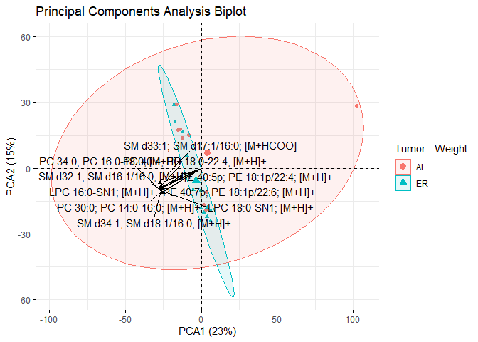
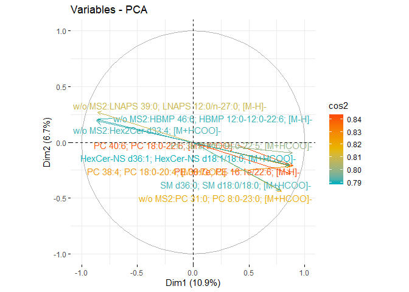
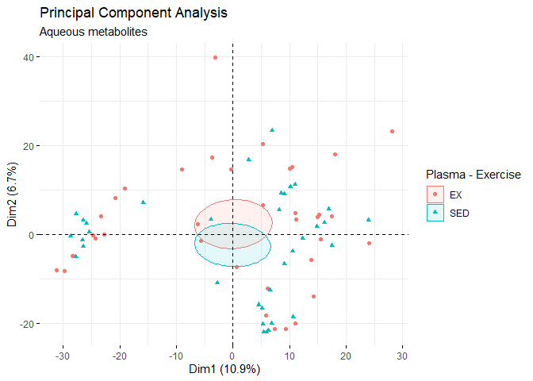
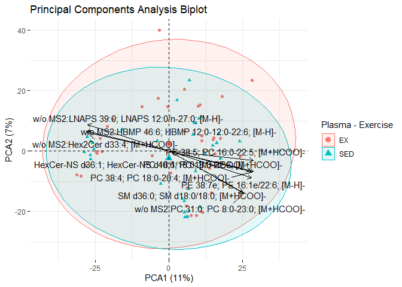

Metabolomics PCA
================
Emily Bean
2/12/2020

Overview
========

This script performs a principal components analysis (PCA) on each data subset and then creates several diagnostics plots, then a grouping PCA and a biplot.

The top eigenvalues are shown for each PCA.

Pairwise comparisons
====================

*All comparisons made for both tumor and plasma tissues*

1.  Plasma vs tumor
2.  Plasma D7 vs D21 vd D35
3.  4 treatment groups (2x2 factorial)
4.  Exercise vs sedentary
5.  Weight gain vs weight maintenance

Plasma vs tumor
---------------

    ## 
    ##  printing top eigenvalues... 
    ## 
    ##       eigenvalue variance.percent cumulative.variance.percent
    ## Dim.1  780.38533        32.061846                    32.06185
    ## Dim.2  217.26552         8.926274                    40.98812
    ## Dim.3  117.04526         4.808762                    45.79688
    ## Dim.4  103.46818         4.250952                    50.04783
    ## Dim.5   73.02104         3.000043                    53.04788
    ## Dim.6   58.27976         2.394403                    55.44228
    ## [[1]]

    ## 
    ## [[2]]

    ## 
    ## [[3]]

    ## 
    ## [[4]]

    ## 
    ## [[5]]

    ## [[1]]

    ## 
    ## [[2]]

Plasma D7 vs D21 vd D35
-----------------------

    ## 
    ##  printing top eigenvalues... 
    ## 
    ##       eigenvalue variance.percent cumulative.variance.percent
    ## Dim.1  264.43719        10.864305                    10.86431
    ## Dim.2  162.90190         6.692765                    17.55707
    ## Dim.3  139.12316         5.715824                    23.27289
    ## Dim.4  114.44171         4.701796                    27.97469
    ## Dim.5   98.16118         4.032916                    32.00761
    ## Dim.6   89.52969         3.678295                    35.68590
    ## [[1]]

    ## 
    ## [[2]]

    ## 
    ## [[3]]

    ## 
    ## [[4]]

    ## 
    ## [[5]]

    ## [[1]]

    ## 
    ## [[2]]

Tumor
-----

### 4 treatment groups (2x2 factorial)

    ## 
    ##  printing top eigenvalues... 
    ## 
    ##       eigenvalue variance.percent cumulative.variance.percent
    ## Dim.1   562.3287        23.103069                    23.10307
    ## Dim.2   353.4128        14.519837                    37.62291
    ## Dim.3   216.1387         8.879979                    46.50289
    ## Dim.4   193.0489         7.931344                    54.43423
    ## Dim.5   150.9567         6.202001                    60.63623
    ## Dim.6   120.8443         4.964845                    65.60108
    ## [[1]]

    ## 
    ## [[2]]

    ## 
    ## [[3]]

    ## 
    ## [[4]]

    ## 
    ## [[5]]

    ## [[1]]

    ## 
    ## [[2]]

### Exercise vs sedentary

    ## [[1]]

    ## 
    ## [[2]]

### Weight gain vs weight maintenance

    ## [[1]]

    ## 
    ## [[2]]

Plasma
------

### 4 treatment groups

    ## 
    ##  printing top eigenvalues... 
    ## 
    ##       eigenvalue variance.percent cumulative.variance.percent
    ## Dim.1  264.43719        10.864305                    10.86431
    ## Dim.2  162.90190         6.692765                    17.55707
    ## Dim.3  139.12316         5.715824                    23.27289
    ## Dim.4  114.44171         4.701796                    27.97469
    ## Dim.5   98.16118         4.032916                    32.00761
    ## Dim.6   89.52969         3.678295                    35.68590
    ## [[1]]

    ## 
    ## [[2]]

    ## 
    ## [[3]]

    ## 
    ## [[4]]

    ## 
    ## [[5]]

    ## [[1]]

    ## 
    ## [[2]]

### Exercise vs sedentary

    ## [[1]]

    ## 
    ## [[2]]

### Weight gain vs weight maintenance

    ## [[1]]

    ## 
    ## [[2]]

