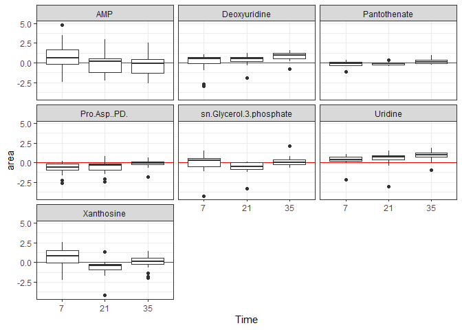
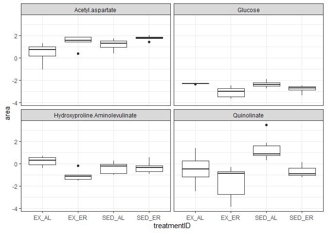
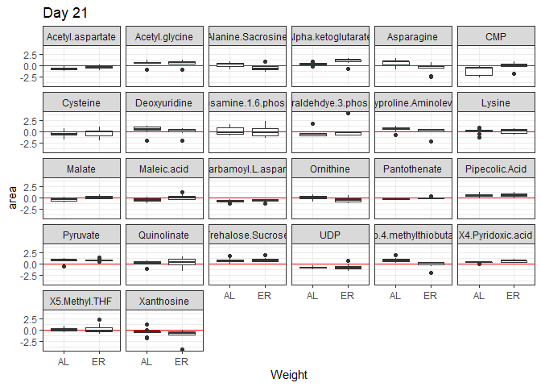

Metabolomic Analysis
================
Emily Bean
January 10, 2020

Overview
========

This is the preliminary data analysis for the 15-02 metabolomics dataset, Dr. Connie Rogers lab.

General cleaning steps
----------------------

1.  Download archived raw .wiff files from Metabolomics Core
2.  Convert .wiff to .mzML in ProteoWizard 4.0 (MS Convert)
3.  Peak picking and alignment in MSDIAL (MoNA database for hydrophilic; LipidBlast for lipids)
4.  Tidy in Excel
5.  Upload to MetaboAnalyst; quantile normalization, Pareto scaling, and log transformation
6.  Download normalized data for statistical analysis in R

Analysis Steps
--------------

1.  Individual metabolites (THIS SCRIPT)
2.  Sample clustering
3.  Metabolic "community" (`metabolomicsNMDS.Rmd`)

Pairwise comparisons
====================

*All comparisons made for both tumor and plasma tissues*

1.  Plasma vs tumor
2.  Plasma D7 vs D21 vd D35
3.  4 treatment groups (2x2 factorial)
4.  Exercise vs sedentary
5.  Weight gain vs weight maintenance

**Note:** These are *annotated metabolites only*. In the raw dataset are many tens of thousands more metabolites and lipids that were detected as compounds but not annotated; we can do a community analysis on these later if we want to.

**Note: in pairwise comparions, the data has been normalized, scaled, and log-transformed in MetaboAnalyst. An accompanying PDF report describes those steps.**

Plasma vs tumor
---------------

We would assume that the plasma and tumor tissue would differ significantly in their metabolic makeup, so this is really more of a "double-check" than an an analysis.

| metabolite                         |     fStat| contrast       |    estimate|     SE|   df|  t.ratio|  p.value|
|:-----------------------------------|---------:|:---------------|-----------:|------:|----:|--------:|--------:|
| Pyruvate                           |   84.6312| plasma - tumor |   2.1756211|  0.236|   83|    9.200|    0.000|
| X2.Oxobutanoate                    |   17.6320| plasma - tumor |   1.2224319|  0.291|   83|    4.199|    0.000|
| Acetoacetate                       |   30.9197| plasma - tumor |   1.4925135|  0.268|   83|    5.561|    0.000|
| X3.Hydroxybutyric.acid             |   26.1005| plasma - tumor |   1.4561872|  0.285|   83|    5.109|    0.000|
| Serine                             |   23.6487| plasma - tumor |   1.1245657|  0.231|   83|    4.863|    0.000|
| Glycerate                          |   49.0897| plasma - tumor |   1.4720622|  0.210|   83|    7.006|    0.000|
| Uracil                             |   57.6070| plasma - tumor |   2.5059812|  0.330|   83|    7.590|    0.000|
| Proline                            |    4.4720| plasma - tumor |  -0.3912437|  0.185|   83|   -2.115|    0.037|
| Maleic.acid                        |   54.3404| plasma - tumor |  -1.9180123|  0.260|   83|   -7.372|    0.000|
| Fumarate                           |   65.8562| plasma - tumor |  -1.5942845|  0.196|   83|   -8.115|    0.000|
| X2.Keto.isovalerate                |   57.8577| plasma - tumor |   2.2291250|  0.293|   83|    7.606|    0.000|
| Acetyl.glycine                     |   91.6729| plasma - tumor |   1.9391102|  0.203|   83|    9.575|    0.000|
| Valine.5.Aminopentanoic.acid       |    4.1041| plasma - tumor |   0.4245551|  0.210|   83|    2.026|    0.046|
| Succinate.Methylmalonic.acid       |   73.8988| plasma - tumor |   1.7670370|  0.206|   83|    8.596|    0.000|
| Threonine.Homoserine               |   24.4890| plasma - tumor |   1.2807129|  0.259|   83|    4.949|    0.000|
| Cysteine                           |    5.5153| plasma - tumor |  -0.6359956|  0.271|   83|   -2.348|    0.021|
| Nicotinate                         |    5.7519| plasma - tumor |  -0.5376586|  0.224|   83|   -2.398|    0.019|
| Pyroglutamic.acid                  |    8.6334| plasma - tumor |  -1.0313070|  0.351|   83|   -2.938|    0.004|
| Pipecolic.Acid                     |  103.7634| plasma - tumor |   1.9241235|  0.189|   83|   10.186|    0.000|
| Citraconic.acid                    |   21.9291| plasma - tumor |   1.2935344|  0.276|   83|    4.683|    0.000|
| Ketoleucine                        |   28.7654| plasma - tumor |   1.4455064|  0.270|   83|    5.363|    0.000|
| Hydroxyproline.Aminolevulinate     |    7.5134| plasma - tumor |   0.5323683|  0.194|   83|    2.741|    0.007|
| N.Acetyl.L.alanine                 |  241.9866| plasma - tumor |  -2.3668851|  0.152|   83|  -15.556|    0.000|
| Leucine.Isoleucine                 |    8.8679| plasma - tumor |  -0.6447746|  0.217|   83|   -2.978|    0.004|
| Hydroxyisocaproic.acid             |  113.8077| plasma - tumor |   1.9374116|  0.182|   83|   10.668|    0.000|
| Ornithine                          |   10.3017| plasma - tumor |  -0.6940121|  0.216|   83|   -3.210|    0.002|
| Malate                             |   28.9172| plasma - tumor |  -1.7607439|  0.327|   83|   -5.377|    0.000|
| Homocysteine.Methylcysteine        |  177.3645| plasma - tumor |   2.3928676|  0.180|   83|   13.318|    0.000|
| Anthranilate                       |   70.5886| plasma - tumor |   2.3770995|  0.283|   83|    8.402|    0.000|
| Acetylphosphate                    |   34.7000| plasma - tumor |   1.4084792|  0.239|   83|    5.891|    0.000|
| Alpha.ketoglutarate                |  229.5003| plasma - tumor |   2.7721353|  0.183|   83|   15.149|    0.000|
| Glutamine                          |  136.1795| plasma - tumor |   2.5855567|  0.222|   83|   11.670|    0.000|
| X2.Oxo.4.methylthiobutanoate       |   40.4007| plasma - tumor |   1.7831695|  0.281|   83|    6.356|    0.000|
| Ribose                             |  299.3301| plasma - tumor |   3.2972900|  0.191|   83|   17.301|    0.000|
| X3.Methylphenylacetic.acid         |   77.6600| plasma - tumor |   2.5583198|  0.290|   83|    8.812|    0.000|
| Xanthine                           |   37.0210| plasma - tumor |  -2.2039134|  0.362|   83|   -6.084|    0.000|
| Hydroxyphenylacetic.acid           |   29.8791| plasma - tumor |   1.5334686|  0.281|   83|    5.466|    0.000|
| X2.3.Dihydroxybenzoic.acid         |   82.3590| plasma - tumor |   2.8686417|  0.316|   83|    9.075|    0.000|
| Histidine                          |   17.0854| plasma - tumor |  -0.9301580|  0.225|   83|   -4.133|    0.000|
| X2.Aminooctanoic.acid              |   13.1829| plasma - tumor |   1.0686845|  0.294|   83|    3.631|    0.000|
| Indole.3.carboxylic.acid           |  254.0465| plasma - tumor |   2.9145485|  0.183|   83|   15.939|    0.000|
| Phenylpyruvate                     |  147.3526| plasma - tumor |   2.6560416|  0.219|   83|   12.139|    0.000|
| Phenylalanine                      |   13.5371| plasma - tumor |  -0.8498785|  0.231|   83|   -3.679|    0.000|
| Phenyllactic.acid                  |   41.6128| plasma - tumor |   1.4229450|  0.221|   83|    6.451|    0.000|
| Dihydroxy.acetone.phosphate        |  107.6703| plasma - tumor |  -2.6256052|  0.253|   83|  -10.376|    0.000|
| Glyceraldehdye.3.phosphate         |    5.7777| plasma - tumor |  -0.7117214|  0.296|   83|   -2.404|    0.018|
| sn.Glycerol.3.phosphate            |    5.9898| plasma - tumor |  -0.6380260|  0.261|   83|   -2.447|    0.016|
| Aconitate                          |   81.2703| plasma - tumor |   1.3691899|  0.152|   83|    9.015|    0.000|
| N.Acetyl.L.ornithine               |  235.8861| plasma - tumor |   2.8209545|  0.184|   83|   15.359|    0.000|
| Arginine                           |   67.8644| plasma - tumor |   1.6484548|  0.200|   83|    8.238|    0.000|
| Acetyl.aspartate                   |  157.8645| plasma - tumor |  -1.7160310|  0.137|   83|  -12.564|    0.000|
| Citrulline                         |  181.2775| plasma - tumor |   2.5947347|  0.193|   83|   13.464|    0.000|
| Ascorbic.acid                      |   74.1684| plasma - tumor |  -3.3358861|  0.387|   83|   -8.612|    0.000|
| N.Carbamoyl.L.aspartate            |  155.6248| plasma - tumor |  -2.4474985|  0.196|   83|  -12.475|    0.000|
| Allantoate                         |  119.8033| plasma - tumor |   2.5139176|  0.230|   83|   10.945|    0.000|
| X2.Isopropylmalic.acid             |   56.0398| plasma - tumor |   2.0532332|  0.274|   83|    7.486|    0.000|
| Glucono.\_.lactone                 |   56.3025| plasma - tumor |   2.1405341|  0.285|   83|    7.504|    0.000|
| Hydroxyphenylpyruvate              |  197.4857| plasma - tumor |   3.2008571|  0.228|   83|   14.053|    0.000|
| Glucose                            |  279.6498| plasma - tumor |   3.4832275|  0.208|   83|   16.723|    0.000|
| X4.Pyridoxic.acid                  |  108.6576| plasma - tumor |   2.2662886|  0.217|   83|   10.424|    0.000|
| X3.Phospho.serine                  |    4.8985| plasma - tumor |   0.5139045|  0.232|   83|    2.213|    0.030|
| X3.Phosphoglycerate                |   24.8916| plasma - tumor |  -1.6804517|  0.337|   83|   -4.989|    0.000|
| N.Acetyl.glutamine                 |  159.6602| plasma - tumor |   3.5530950|  0.281|   83|   12.636|    0.000|
| Acetyllysine                       |   88.3675| plasma - tumor |   1.8076493|  0.192|   83|    9.400|    0.000|
| Kynurenic.acid                     |  304.5064| plasma - tumor |   3.0471436|  0.175|   83|   17.450|    0.000|
| X2.Keto.D.gluconate                |   18.3851| plasma - tumor |   1.1824336|  0.276|   83|    4.288|    0.000|
| Tryptophan                         |   88.5027| plasma - tumor |   2.2300486|  0.237|   83|    9.408|    0.000|
| Xanthurenic.acid                   |  141.6901| plasma - tumor |   2.5541438|  0.215|   83|   11.903|    0.000|
| Deoxyribose.phosphate              |   98.3891| plasma - tumor |  -2.1444984|  0.216|   83|   -9.919|    0.000|
| Cystathionine                      |  114.7699| plasma - tumor |   2.3161211|  0.216|   83|   10.713|    0.000|
| Deoxyuridine                       |   48.3608| plasma - tumor |   1.6785518|  0.241|   83|    6.954|    0.000|
| Ribulose.5.phosphate               |   68.7539| plasma - tumor |  -2.0810608|  0.251|   83|   -8.292|    0.000|
| Ribose.5.phosphate                 |   60.8630| plasma - tumor |  -1.6893527|  0.217|   83|   -7.801|    0.000|
| Pro.Asp..PD.                       |   86.4222| plasma - tumor |  -1.7536358|  0.189|   83|   -9.296|    0.000|
| Val.Asp..VD.                       |   56.4023| plasma - tumor |  -1.3943072|  0.186|   83|   -7.510|    0.000|
| Uridine                            |  119.1946| plasma - tumor |   2.2667990|  0.208|   83|   10.918|    0.000|
| Glucose.1.6.phosphate              |  263.7875| plasma - tumor |  -3.0824551|  0.190|   83|  -16.242|    0.000|
| Fructose.6.phosphate               |  167.1158| plasma - tumor |  -2.8270712|  0.219|   83|  -12.927|    0.000|
| Inosine                            |   86.0438| plasma - tumor |   3.1196547|  0.336|   83|    9.276|    0.000|
| Chlorpropamide                     |   35.9993| plasma - tumor |   1.7409446|  0.290|   83|    6.000|    0.000|
| Pantetheine                        |  135.7835| plasma - tumor |  -2.5279637|  0.217|   83|  -11.653|    0.000|
| D.Sedoheptulose.1.7.phosphate      |  184.5847| plasma - tumor |  -3.2577099|  0.240|   83|  -13.586|    0.000|
| S.Methyl.5..thioadenosine          |   14.6763| plasma - tumor |   1.3573675|  0.354|   83|    3.831|    0.000|
| X4.Phosphopantothenate             |   23.8218| plasma - tumor |  -1.2718718|  0.261|   83|   -4.881|    0.000|
| N.Acetyl.glucosamine.1.6.phosphate |   49.2085| plasma - tumor |  -2.0678419|  0.295|   83|   -7.015|    0.000|
| dCMP                               |  210.0707| plasma - tumor |  -3.1221313|  0.215|   83|  -14.494|    0.000|
| Glutathione                        |  337.9632| plasma - tumor |  -3.3601150|  0.183|   83|  -18.384|    0.000|
| dTMP                               |  116.2563| plasma - tumor |  -2.5272443|  0.234|   83|  -10.782|    0.000|
| CMP                                |   16.9434| plasma - tumor |  -1.1210471|  0.272|   83|   -4.116|    0.000|
| UMP                                |   44.7294| plasma - tumor |   1.4841535|  0.222|   83|    6.688|    0.000|
| Cyclic.AMP                         |   23.1172| plasma - tumor |   1.2776861|  0.266|   83|    4.808|    0.000|
| dAMP                               |  259.3672| plasma - tumor |  -2.9542720|  0.183|   83|  -16.105|    0.000|
| Fructose.1.6.bisphosphate          |  167.2910| plasma - tumor |  -3.6859768|  0.285|   83|  -12.934|    0.000|
| Trehalose.Sucrose                  |  191.0546| plasma - tumor |   3.1141957|  0.225|   83|   13.822|    0.000|
| GMP                                |    8.3924| plasma - tumor |  -0.9435414|  0.326|   83|   -2.897|    0.005|
| Sedoheptoluse.bisphosphate         |  199.4594| plasma - tumor |  -3.4205970|  0.242|   83|  -14.123|    0.000|
| Octoluse.bisphosphate              |   68.1259| plasma - tumor |  -1.8997987|  0.230|   83|   -8.254|    0.000|
| CDP                                |   12.2924| plasma - tumor |   0.8157749|  0.233|   83|    3.506|    0.001|
| UDP                                |   74.5799| plasma - tumor |  -2.3567245|  0.273|   83|   -8.636|    0.000|
| Trehalose.6.Phosphate              |   16.0494| plasma - tumor |   1.1497195|  0.287|   83|    4.006|    0.000|
| ADP                                |   83.1996| plasma - tumor |  -2.4435394|  0.268|   83|   -9.121|    0.000|
| GDP                                |    5.6385| plasma - tumor |   0.7691356|  0.324|   83|    2.375|    0.020|
| CDP.ethanolamine                   |  227.1870| plasma - tumor |  -3.1581322|  0.210|   83|  -15.073|    0.000|
| FMN                                |   19.3121| plasma - tumor |  -1.1710030|  0.266|   83|   -4.395|    0.000|
| X5.Methyl.THF                      |   12.7003| plasma - tumor |   0.8298597|  0.233|   83|    3.564|    0.001|
| UTP                                |  148.0808| plasma - tumor |   2.9928997|  0.246|   83|   12.169|    0.000|
| CDP.choline                        |   93.7884| plasma - tumor |  -1.7000778|  0.176|   83|   -9.684|    0.000|
| UDP.D.glucose                      |  216.9338| plasma - tumor |  -3.7393040|  0.254|   83|  -14.729|    0.000|
| UDP.D.glucuronate                  |  311.1029| plasma - tumor |  -3.4284956|  0.194|   83|  -17.638|    0.000|
| ADP.D.glucose                      |  344.0909| plasma - tumor |  -2.6027386|  0.140|   83|  -18.550|    0.000|
| UDP.N.acetyl.glucosamine           |  166.1914| plasma - tumor |  -3.4014665|  0.264|   83|  -12.892|    0.000|
| Glutathione.disulfide              |   97.0545| plasma - tumor |  -2.8170051|  0.286|   83|   -9.852|    0.000|
| FAD                                |   33.2556| plasma - tumor |  -1.1709933|  0.203|   83|   -5.767|    0.000|

| metabolite                         |  Plasma mean|  Tumor mean|
|:-----------------------------------|------------:|-----------:|
| Acetoacetate                       |        0.369|      -1.124|
| Acetyl.aspartate                   |       -0.424|       1.292|
| Acetyl.glycine                     |        0.479|      -1.460|
| Acetyllysine                       |        0.447|      -1.361|
| Acetylphosphate                    |        0.348|      -1.061|
| Aconitate                          |        0.338|      -1.031|
| ADP                                |       -0.604|       1.840|
| ADP.D.glucose                      |       -0.643|       1.960|
| Allantoate                         |        0.621|      -1.893|
| Alpha.ketoglutarate                |        0.685|      -2.087|
| Anthranilate                       |        0.587|      -1.790|
| Arginine                           |        0.407|      -1.241|
| Ascorbic.acid                      |       -0.824|       2.512|
| CDP                                |        0.202|      -0.614|
| CDP.choline                        |       -0.420|       1.280|
| CDP.ethanolamine                   |       -0.780|       2.378|
| Chlorpropamide                     |        0.430|      -1.311|
| Citraconic.acid                    |        0.320|      -0.974|
| Citrulline                         |        0.641|      -1.954|
| CMP                                |       -0.277|       0.844|
| Cyclic.AMP                         |        0.316|      -0.962|
| Cystathionine                      |        0.572|      -1.744|
| Cysteine                           |       -0.157|       0.479|
| D.Sedoheptulose.1.7.phosphate      |       -0.805|       2.453|
| dAMP                               |       -0.730|       2.224|
| dCMP                               |       -0.771|       2.351|
| Deoxyribose.phosphate              |       -0.530|       1.615|
| Deoxyuridine                       |        0.415|      -1.264|
| Dihydroxy.acetone.phosphate        |       -0.649|       1.977|
| dTMP                               |       -0.624|       1.903|
| FAD                                |       -0.289|       0.882|
| FMN                                |       -0.289|       0.882|
| Fructose.1.6.bisphosphate          |       -0.911|       2.775|
| Fructose.6.phosphate               |       -0.698|       2.129|
| Fumarate                           |       -0.394|       1.200|
| GDP                                |        0.190|      -0.579|
| Glucono.\_.lactone                 |        0.529|      -1.612|
| Glucose                            |        0.861|      -2.623|
| Glucose.1.6.phosphate              |       -0.762|       2.321|
| Glutamine                          |        0.639|      -1.947|
| Glutathione                        |       -0.830|       2.530|
| Glutathione.disulfide              |       -0.696|       2.121|
| Glyceraldehdye.3.phosphate         |       -0.176|       0.536|
| Glycerate                          |        0.364|      -1.108|
| GMP                                |       -0.233|       0.710|
| Histidine                          |       -0.230|       0.700|
| Homocysteine.Methylcysteine        |        0.591|      -1.802|
| Hydroxyisocaproic.acid             |        0.479|      -1.459|
| Hydroxyphenylacetic.acid           |        0.379|      -1.155|
| Hydroxyphenylpyruvate              |        0.791|      -2.410|
| Hydroxyproline.Aminolevulinate     |        0.132|      -0.401|
| Indole.3.carboxylic.acid           |        0.720|      -2.194|
| Inosine                            |        0.771|      -2.349|
| Ketoleucine                        |        0.357|      -1.088|
| Kynurenic.acid                     |        0.753|      -2.294|
| Leucine.Isoleucine                 |       -0.159|       0.485|
| Malate                             |       -0.435|       1.326|
| Maleic.acid                        |       -0.474|       1.444|
| N.Acetyl.glucosamine.1.6.phosphate |       -0.511|       1.557|
| N.Acetyl.glutamine                 |        0.878|      -2.675|
| N.Acetyl.L.alanine                 |       -0.585|       1.782|
| N.Acetyl.L.ornithine               |        0.697|      -2.124|
| N.Carbamoyl.L.aspartate            |       -0.605|       1.843|
| Nicotinate                         |       -0.133|       0.405|
| Octoluse.bisphosphate              |       -0.469|       1.430|
| Ornithine                          |       -0.171|       0.523|
| Pantetheine                        |       -0.625|       1.903|
| Phenylalanine                      |       -0.210|       0.640|
| Phenyllactic.acid                  |        0.352|      -1.071|
| Phenylpyruvate                     |        0.656|      -2.000|
| Pipecolic.Acid                     |        0.475|      -1.449|
| Pro.Asp..PD.                       |       -0.433|       1.320|
| Proline                            |       -0.097|       0.295|
| Pyroglutamic.acid                  |       -0.255|       0.777|
| Pyruvate                           |        0.538|      -1.638|
| Ribose                             |        0.815|      -2.483|
| Ribose.5.phosphate                 |       -0.417|       1.272|
| Ribulose.5.phosphate               |       -0.514|       1.567|
| S.Methyl.5..thioadenosine          |        0.335|      -1.022|
| Sedoheptoluse.bisphosphate         |       -0.845|       2.576|
| Serine                             |        0.278|      -0.847|
| sn.Glycerol.3.phosphate            |       -0.158|       0.480|
| Succinate.Methylmalonic.acid       |        0.437|      -1.330|
| Threonine.Homoserine               |        0.316|      -0.964|
| Trehalose.6.Phosphate              |        0.284|      -0.866|
| Trehalose.Sucrose                  |        0.769|      -2.345|
| Tryptophan                         |        0.551|      -1.679|
| UDP                                |       -0.582|       1.774|
| UDP.D.glucose                      |       -0.924|       2.815|
| UDP.D.glucuronate                  |       -0.847|       2.581|
| UDP.N.acetyl.glucosamine           |       -0.840|       2.561|
| UMP                                |        0.367|      -1.117|
| Uracil                             |        0.619|      -1.887|
| Uridine                            |        0.560|      -1.707|
| UTP                                |        0.739|      -2.253|
| Val.Asp..VD.                       |       -0.344|       1.050|
| Valine.5.Aminopentanoic.acid       |        0.105|      -0.320|
| X2.3.Dihydroxybenzoic.acid         |        0.709|      -2.160|
| X2.Aminooctanoic.acid              |        0.264|      -0.805|
| X2.Isopropylmalic.acid             |        0.507|      -1.546|
| X2.Keto.D.gluconate                |        0.292|      -0.890|
| X2.Keto.isovalerate                |        0.551|      -1.678|
| X2.Oxo.4.methylthiobutanoate       |        0.441|      -1.343|
| X2.Oxobutanoate                    |        0.302|      -0.920|
| X3.Hydroxybutyric.acid             |        0.360|      -1.096|
| X3.Methylphenylacetic.acid         |        0.632|      -1.926|
| X3.Phospho.serine                  |        0.127|      -0.387|
| X3.Phosphoglycerate                |       -0.415|       1.265|
| X4.Phosphopantothenate             |       -0.314|       0.958|
| X4.Pyridoxic.acid                  |        0.560|      -1.706|
| X5.Methyl.THF                      |        0.205|      -0.625|
| Xanthine                           |       -0.544|       1.659|
| Xanthurenic.acid                   |        0.631|      -1.923|

Since there are only two explanatory variables (plasma and tumor), this is technically a t-test so no Tukey's post-hoc is performed. Boxplots visulize the differences and a table of means is shown. Interestingly, the plasma metabolites are all higher than the tumor metabolites. There seem to be several high outliers, even in the normalized data.The boxplots also illustrate that most metabolites have a positive log change in the plasma tissue and a negative log change in the tumor tissue.

Plasma D7 vs D21 v D35
----------------------

It's important for downstream analysis to first determine if the plasma metabolome change significantly from day 7, to day 21, to day 35. If there are differences, we will need to keep the days separate for downstream analyses; if not, we can likely lump them all together.

|     | metabolite                  |    fStat| contrast |    estimate|     SE|   df|  t.ratio|  p.value|
|-----|:----------------------------|--------:|:---------|-----------:|------:|----:|--------:|--------:|
| 3   | Pyruvate                    |   4.4106| 21 - 35  |   0.6697998|  0.240|   61|    2.795|    0.019|
| 2   | Alanine.Sacrosine           |  10.4145| 7 - 35   |  -1.0678839|  0.240|   61|   -4.448|    0.000|
| 31  | Alanine.Sacrosine           |  10.4145| 21 - 35  |  -0.7226311|  0.247|   61|   -2.929|    0.013|
| 21  | X3.Hydroxybutyric.acid      |   4.1937| 7 - 35   |   0.5896581|  0.220|   61|    2.676|    0.026|
| 22  | Serine                      |   4.9959| 7 - 35   |  -0.8654239|  0.274|   61|   -3.161|    0.007|
| 32  | Uracil                      |   3.9600| 21 - 35  |   0.4981557|  0.194|   61|    2.568|    0.033|
| 23  | Threonine.Homoserine        |   3.4246| 7 - 35   |  -0.7231883|  0.277|   61|   -2.615|    0.030|
| 1   | Nicotinate                  |   4.1435| 7 - 21   |   0.6612875|  0.248|   61|    2.663|    0.026|
| 33  | Taurine                     |   4.7403| 21 - 35  |  -0.6816608|  0.242|   61|   -2.816|    0.018|
| 24  | Citraconic.acid             |   4.5520| 7 - 35   |   0.6904726|  0.266|   61|    2.598|    0.031|
| 34  | Citraconic.acid             |   4.5520| 21 - 35  |   0.6954141|  0.273|   61|    2.546|    0.035|
| 25  | N.Acetyl.L.alanine          |   5.5883| 7 - 35   |  -0.4460298|  0.141|   61|   -3.156|    0.007|
| 35  | N.Acetyl.L.alanine          |   5.5883| 21 - 35  |  -0.3510132|  0.145|   61|   -2.416|    0.048|
| 26  | Leucine.Isoleucine          |   2.9362| 7 - 35   |  -0.5088675|  0.211|   61|   -2.414|    0.049|
| 27  | Asparagine                  |   5.8338| 7 - 35   |  -0.9701278|  0.284|   61|   -3.414|    0.003|
| 28  | Homocysteine.Methylcysteine |   3.3303| 7 - 35   |  -0.4534735|  0.178|   61|   -2.547|    0.035|
| 29  | Anthranilate                |   4.2432| 7 - 35   |   0.4842139|  0.196|   61|    2.465|    0.043|
| 36  | Anthranilate                |   4.2432| 21 - 35  |   0.5053494|  0.202|   61|    2.503|    0.039|
| 210 | Methionine                  |   5.6469| 7 - 35   |  -0.6549913|  0.216|   61|   -3.029|    0.010|
| 37  | Methionine                  |   5.6469| 21 - 35  |  -0.5940153|  0.222|   61|   -2.673|    0.026|
| 211 | X2.Aminooctanoic.acid       |   4.8766| 7 - 35   |   0.7652508|  0.275|   61|    2.781|    0.019|
| 38  | X2.Aminooctanoic.acid       |   4.8766| 21 - 35  |   0.7152616|  0.283|   61|    2.529|    0.037|
| 39  | sn.Glycerol.3.phosphate     |   3.9258| 21 - 35  |  -0.7449903|  0.269|   61|   -2.768|    0.020|
| 212 | Pantothenate                |   8.0261| 7 - 35   |  -0.3263773|  0.089|   61|   -3.677|    0.001|
| 310 | Pantothenate                |   8.0261| 21 - 35  |  -0.2817081|  0.091|   61|   -3.088|    0.008|
| 213 | Deoxyuridine                |   6.3882| 7 - 35   |  -0.8914101|  0.256|   61|   -3.485|    0.003|
| 214 | Pro.Asp..PD.                |   4.7172| 7 - 35   |  -0.6129009|  0.206|   61|   -2.972|    0.012|
| 215 | Uridine                     |   3.9704| 7 - 35   |  -0.5843259|  0.218|   61|   -2.686|    0.025|
| 11  | Xanthosine                  |   8.5599| 7 - 21   |   1.3647889|  0.330|   61|    4.138|    0.000|
| 216 | AMP                         |   3.2634| 7 - 35   |   1.0809500|  0.442|   61|    2.444|    0.045|
| 12  | FMN                         |   4.9084| 7 - 21   |  -0.9535323|  0.325|   61|   -2.936|    0.013|
| 217 | FMN                         |   4.9084| 7 - 35   |  -0.7422961|  0.306|   61|   -2.422|    0.048|
| 311 | UDP.N.acetyl.glucosamine    |   3.0304| 21 - 35  |  -0.6981961|  0.286|   61|   -2.441|    0.046|

Another visualization tool is boxplots.

An ANOVA on each individual metabolite by Time shows that there are multiple metabolites that differ between the times, so when analyzing plasma metabolome we will keep Time as a separate factor. The Tukey tests indicate that most metabolites differ between either D7 and D35, or D21 and D35. Few (or none) indicate difference between D7 and D21. This should be explored further to examine if the differences are due to cancer development or if they can be attributed to other things like growth and metabolism.

Four treatment groups
---------------------

The initial analyis is comparing all four treatment groups to each other in the 2x2 factorial style. The code follows this structure for pairwise comparisons with ANOVA:

> This code is a one-way ANOVA between the log-transformed area under the curve (dependent variable) and the four treatment groups (independent variable) for the tumor tissue only. This ANOVA repeats in a "for loop" for all 136 aqueous metabolites, and stores the p values in a table.

### Tumor tissue

There are four significant metabolites; that is, four metabolites vary significantly between the four treatment groups in the tumor tissue.

|     | metabolite                     |   fStat| contrast          |    estimate|     SE|   df|  t.ratio|  p.value|
|-----|:-------------------------------|-------:|:------------------|-----------:|------:|----:|--------:|--------:|
| 1   | Hydroxyproline.Aminolevulinate |  4.3665| EX\_AL - EX\_ER   |   1.2602894|  0.353|   17|    3.573|    0.011|
| 4   | Quinolinate                    |  6.0403| EX\_ER - SED\_AL  |  -3.0450679|  0.741|   17|   -4.107|    0.004|
| 6   | Quinolinate                    |  6.0403| SED\_AL - SED\_ER |   2.0493143|  0.707|   17|    2.899|    0.045|
| 3   | Acetyl.aspartate               |  4.2735| EX\_AL - SED\_ER  |  -1.3497777|  0.384|   17|   -3.512|    0.013|
| 11  | Glucose                        |  5.6869| EX\_AL - EX\_ER   |   0.7631781|  0.225|   17|    3.395|    0.016|
| 41  | Glucose                        |  5.6869| EX\_ER - SED\_AL  |  -0.6969954|  0.203|   17|   -3.435|    0.015|

Quinolinate and Glucose both vary between two different treatments, which is why they are listed twice. It is important to note that dividing the data into four treatment groups rather than two (e.g. Exercise vs Sedentary) decreases the number of mice in each group, which is likely why there are fewer metabolites that are significant when comparing all 4 groups.

### Plasma

Since we clearly saw that there is a difference in the plasma aqueous metabolites between days (above), we will keep Time as a separate factor moving forward. Therefore, there are 3 separate ANOVAs performed for each test; one for each time point. The results of each time point are independent of the others.

|     | metabolite                   | Time |   fStat| contrast          |    estimate|     SE|   df|  t.ratio|  p.value|
|-----|:-----------------------------|:-----|-------:|:------------------|-----------:|------:|----:|--------:|--------:|
| 8   | Pyruvate                     | D21  |  3.2470| EX\_AL - SED\_AL  |  -0.7254571|  0.239|   15|   -3.032|    0.038|
| 7   | Alanine.Sacrosine            | D21  |  4.0877| EX\_AL - EX\_ER   |   1.2470241|  0.420|   15|    2.969|    0.042|
| 10  | Alanine.Sacrosine            | D21  |  4.0877| EX\_ER - SED\_AL  |  -1.0152247|  0.348|   15|   -2.915|    0.047|
| 71  | Maleic.acid                  | D21  |  4.6255| EX\_AL - EX\_ER   |  -1.1634300|  0.347|   15|   -3.354|    0.020|
| 101 | Maleic.acid                  | D21  |  4.6255| EX\_ER - SED\_AL  |   0.8502497|  0.288|   15|    2.956|    0.044|
| 16  | Acetyl.glycine               | D35  |  4.2367| EX\_ER - SED\_AL  |  -1.1828718|  0.358|   20|   -3.304|    0.017|
| 18  | Cysteine                     | D35  |  4.0303| SED\_AL - SED\_ER |   1.5530875|  0.475|   20|    3.268|    0.019|
| 1   | Pipecolic.Acid               | D7   |  3.5575| EX\_AL - EX\_ER   |   0.8698665|  0.290|   17|    2.998|    0.037|
| 72  | Leucine.Isoleucine           | D21  |  3.6967| EX\_AL - EX\_ER   |   1.2429097|  0.416|   15|    2.988|    0.041|
| 81  | Leucine.Isoleucine           | D21  |  3.6967| EX\_AL - SED\_AL  |   1.1655654|  0.403|   15|    2.893|    0.049|
| 11  | Lysine                       | D7   |  4.0390| EX\_AL - EX\_ER   |   1.5322530|  0.453|   17|    3.385|    0.017|
| 73  | X2.Oxo.4.methylthiobutanoate | D21  |  4.9911| EX\_AL - EX\_ER   |   1.5506033|  0.444|   15|    3.493|    0.015|
| 9   | X2.Oxo.4.methylthiobutanoate | D21  |  4.9911| EX\_AL - SED\_ER  |   1.3119577|  0.444|   15|    2.955|    0.044|
| 111 | Ribose                       | D21  |  3.5104| EX\_ER - SED\_ER  |  -0.8152667|  0.267|   15|   -3.052|    0.036|
| 17  | Xanthine                     | D35  |  5.1733| EX\_ER - SED\_ER  |  -2.0934440|  0.662|   20|   -3.161|    0.023|
| 181 | Xanthine                     | D35  |  5.1733| SED\_AL - SED\_ER |  -2.3271391|  0.687|   20|   -3.386|    0.014|
| 171 | Phenyllactic.acid            | D35  |  3.3543| EX\_ER - SED\_ER  |   1.2189198|  0.389|   20|    3.132|    0.025|
| 74  | Quinolinate                  | D21  |  6.6892| EX\_AL - EX\_ER   |  -1.3830950|  0.434|   15|   -3.185|    0.028|
| 112 | Quinolinate                  | D21  |  6.6892| EX\_ER - SED\_ER  |   1.5478056|  0.376|   15|    4.116|    0.005|
| 75  | Dihydroxy.acetone.phosphate  | D21  |  3.0268| EX\_AL - EX\_ER   |  -1.0099896|  0.348|   15|   -2.901|    0.048|
| 76  | Glucose                      | D21  |  4.6525| EX\_AL - EX\_ER   |   1.0251641|  0.354|   15|    2.893|    0.049|
| 102 | Glucose                      | D21  |  4.6525| EX\_ER - SED\_AL  |  -0.8603491|  0.294|   15|   -2.928|    0.046|
| 113 | Glucose                      | D21  |  4.6525| EX\_ER - SED\_ER  |  -0.9708401|  0.307|   15|   -3.164|    0.029|
| 103 | X4.Pyridoxic.acid            | D21  |  3.2272| EX\_ER - SED\_AL  |   0.4099014|  0.136|   15|    3.009|    0.039|
| 77  | Acetyllysine                 | D21  |  4.4614| EX\_AL - EX\_ER   |   0.9911444|  0.311|   15|    3.186|    0.028|
| 12  | Glucarate                    | D7   |  5.8201| EX\_AL - EX\_ER   |   1.6495867|  0.415|   17|    3.978|    0.005|
| 2   | Glucarate                    | D7   |  5.8201| EX\_AL - SED\_AL  |   1.3072733|  0.448|   17|    2.918|    0.043|
| 114 | Deoxyribose.phosphate        | D21  |  3.4046| EX\_ER - SED\_ER  |   1.5560228|  0.530|   15|    2.936|    0.045|
| 14  | Xanthosine                   | D35  |  7.0130| EX\_AL - SED\_AL  |   1.1512466|  0.391|   20|    2.944|    0.037|
| 161 | Xanthosine                   | D35  |  7.0130| EX\_ER - SED\_AL  |   1.4543127|  0.359|   20|    4.048|    0.003|
| 182 | Xanthosine                   | D35  |  7.0130| SED\_AL - SED\_ER |  -1.4534615|  0.373|   20|   -3.898|    0.005|
| 15  | S.Methyl.5..thioadenosine    | D35  |  4.0050| EX\_AL - SED\_ER  |   1.4549894|  0.505|   20|    2.879|    0.042|
| 172 | S.Methyl.5..thioadenosine    | D35  |  4.0050| EX\_ER - SED\_ER  |   1.3687713|  0.464|   20|    2.947|    0.037|
| 78  | dCMP                         | D21  |  4.2110| EX\_AL - EX\_ER   |  -1.0287827|  0.346|   15|   -2.977|    0.042|
| 115 | dCMP                         | D21  |  4.2110| EX\_ER - SED\_ER  |   0.9039295|  0.299|   15|    3.021|    0.038|
| 121 | UMP                          | D21  |  3.5901| SED\_AL - SED\_ER |  -1.1600781|  0.358|   15|   -3.239|    0.025|
| 104 | CDP.ethanolamine             | D21  |  3.6203| EX\_ER - SED\_AL  |   0.7127392|  0.243|   15|    2.937|    0.045|

Exercise vs. Sedentary
----------------------

Two exercise groups: exercised and exercise-restricted (sedentary).

### Tumor

There is one significant metabolite: Quinolinate.

| metabolite  |   fStat| contrast |   estimate|    SE|   df|  t.ratio|  p.value|
|:------------|-------:|:---------|----------:|-----:|----:|--------:|--------:|
| Quinolinate |  5.2084| EX - SED |  -1.484028|  0.65|   19|   -2.282|    0.034|

Quinolinate is higher in the Sedentary than Exercising group.

### Plasma

|     | metabolite                | Time |   fStat| contrast |    estimate|     SE|   df|  t.ratio|  p.value|
|-----|:--------------------------|:-----|-------:|:---------|-----------:|------:|----:|--------:|--------:|
| 3   | Phenyllactic.acid         | D35  |  6.6334| EX - SED |   0.7537822|  0.293|   22|    2.576|    0.017|
| 2   | Xanthosine                | D21  |  4.6654| EX - SED |  -0.9789703|  0.453|   17|   -2.160|    0.045|
| 1   | Fructose.1.6.bisphosphate | D7   |  6.4247| EX - SED |  -1.2389471|  0.489|   19|   -2.535|    0.020|
| 31  | ADP                       | D35  |  5.1057| EX - SED |  -0.8355132|  0.370|   22|   -2.260|    0.034|
| 21  | CDP.ethanolamine          | D21  |  5.8079| EX - SED |   0.4779519|  0.198|   17|    2.410|    0.028|

| metabolite                |  EX mean|  SED mean|
|:--------------------------|--------:|---------:|
| ADP                       |   -0.871|    -0.336|
| CDP.ethanolamine          |   -0.652|    -0.909|
| Fructose.1.6.bisphosphate |   -1.265|    -0.556|
| Phenyllactic.acid         |    0.550|     0.153|
| Xanthosine                |    0.066|     0.044|

There are multiple significant metabolites between Exercise treatments in the plasma tissue, so these are difficult to visualize with boxplots.

Weight Restricted vs Ad-lib Fed
-------------------------------

Two weight groups: energy restricted and ad libitum fed

### Tumor

| metabolite                  |    fStat| contrast |    estimate|     SE|   df|  t.ratio|  p.value|
|:----------------------------|--------:|:---------|-----------:|------:|----:|--------:|--------:|
| Alanine.Sacrosine           |   5.0834| AL - ER  |  -0.6735539|  0.299|   19|   -2.255|    0.036|
| Acetyl.glycine              |   7.6498| AL - ER  |   1.2268458|  0.444|   19|    2.766|    0.012|
| Pipecolic.Acid              |   9.1041| AL - ER  |   1.2640176|  0.419|   19|    3.017|    0.007|
| Homocysteine.Methylcysteine |   6.3724| AL - ER  |   0.9377814|  0.371|   19|    2.524|    0.021|
| Quinolinate                 |   8.5580| AL - ER  |   1.7666464|  0.604|   19|    2.925|    0.009|
| Acetyl.aspartate            |   6.8353| AL - ER  |  -0.7307415|  0.280|   19|   -2.614|    0.017|
| Glucose                     |  14.8504| AL - ER  |   0.5659873|  0.147|   19|    3.854|    0.001|
| X6.Phospho.D.gluconate      |   6.7873| AL - ER  |   1.4204819|  0.545|   19|    2.605|    0.017|
| Pantetheine                 |   7.9481| AL - ER  |  -1.2969431|  0.460|   19|   -2.819|    0.011|
| X4.Phosphopantothenate      |   5.9799| AL - ER  |  -0.7565339|  0.309|   19|   -2.445|    0.024|
| ADP                         |   5.0108| AL - ER  |  -1.2439139|  0.556|   19|   -2.238|    0.037|
| CDP.ethanolamine            |   4.4310| AL - ER  |  -0.8742820|  0.415|   19|   -2.105|    0.049|
| UTP                         |   4.7132| AL - ER  |   1.4141966|  0.651|   19|    2.171|    0.043|

| metabolite                  |  AL mean|  ER mean|
|:----------------------------|--------:|--------:|
| Acetyl.aspartate            |    0.909|    1.640|
| Acetyl.glycine              |   -0.817|   -2.044|
| ADP                         |    1.188|    2.432|
| Alanine.Sacrosine           |   -0.350|    0.324|
| CDP.ethanolamine            |    1.920|    2.794|
| Glucose                     |   -2.326|   -2.892|
| Homocysteine.Methylcysteine |   -1.310|   -2.248|
| Pantetheine                 |    1.224|    2.521|
| Pipecolic.Acid              |   -0.787|   -2.051|
| Quinolinate                 |    0.615|   -1.151|
| UTP                         |   -1.513|   -2.927|
| X4.Phosphopantothenate      |    0.561|    1.318|
| X6.Phospho.D.gluconate      |    0.382|   -1.039|

### Plasma

|     | metabolite                     | Time |    fStat| contrast |    estimate|     SE|   df|  t.ratio|  p.value|
|-----|:-------------------------------|:-----|--------:|:---------|-----------:|------:|----:|--------:|--------:|
| 3   | Pyruvate                       | D35  |   4.9126| AL - ER  |   0.7815017|  0.353|   22|    2.216|    0.037|
| 2   | Alanine.Sacrosine              | D21  |   4.9300| AL - ER  |   0.6541657|  0.295|   17|    2.220|    0.040|
| 21  | Maleic.acid                    | D21  |   8.1603| AL - ER  |  -0.6679699|  0.234|   17|   -2.857|    0.011|
| 31  | Acetyl.glycine                 | D35  |   9.6475| AL - ER  |   0.8324964|  0.268|   22|    3.106|    0.005|
| 32  | Cysteine                       | D35  |   9.6733| AL - ER  |   1.0555557|  0.339|   22|    3.110|    0.005|
| 1   | Pipecolic.Acid                 | D7   |  10.1045| AL - ER  |   0.6711611|  0.211|   19|    3.179|    0.005|
| 11  | Hydroxyproline.Aminolevulinate | D7   |   6.4560| AL - ER  |   0.8119287|  0.320|   19|    2.541|    0.020|
| 22  | Asparagine                     | D21  |   4.8794| AL - ER  |   0.9757582|  0.442|   17|    2.209|    0.041|
| 23  | Ornithine                      | D21  |   4.5788| AL - ER  |   0.5422631|  0.253|   17|    2.140|    0.047|
| 24  | Malate                         | D21  |   8.5994| AL - ER  |  -0.4673966|  0.159|   17|   -2.932|    0.009|
| 25  | Alpha.ketoglutarate            | D21  |   6.3883| AL - ER  |  -0.6543332|  0.259|   17|   -2.528|    0.022|
| 12  | Lysine                         | D7   |   9.0431| AL - ER  |   1.0349451|  0.344|   19|    3.007|    0.007|
| 26  | X2.Oxo.4.methylthiobutanoate   | D21  |  11.2649| AL - ER  |   0.9654361|  0.288|   17|    3.356|    0.004|
| 33  | Quinolinate                    | D35  |   5.0538| AL - ER  |   0.8294732|  0.369|   22|    2.248|    0.035|
| 34  | Glyceraldehdye.3.phosphate     | D35  |   4.4170| AL - ER  |  -0.4656108|  0.222|   22|   -2.102|    0.047|
| 27  | Acetyl.aspartate               | D21  |   5.0485| AL - ER  |  -0.3511156|  0.156|   17|   -2.247|    0.038|
| 35  | Acetyl.aspartate               | D35  |   7.6479| AL - ER  |  -0.5732023|  0.207|   22|   -2.765|    0.011|
| 13  | N.Carbamoyl.L.aspartate        | D7   |   7.2615| AL - ER  |  -0.4232920|  0.157|   19|   -2.695|    0.014|
| 28  | X4.Pyridoxic.acid              | D21  |   5.9614| AL - ER  |  -0.2616544|  0.107|   17|   -2.442|    0.026|
| 29  | Pantothenate                   | D21  |   5.9733| AL - ER  |  -0.2302161|  0.094|   17|   -2.444|    0.026|
| 36  | Deoxyuridine                   | D35  |   7.0119| AL - ER  |   0.5259068|  0.199|   22|    2.648|    0.015|
| 37  | Glucosamine.1.6.phosphate      | D35  |   4.9640| AL - ER  |  -0.7465556|  0.335|   22|   -2.228|    0.036|
| 38  | Xanthosine                     | D35  |   9.4951| AL - ER  |  -0.9306259|  0.302|   22|   -3.081|    0.005|
| 210 | CMP                            | D21  |   6.3314| AL - ER  |  -1.0412333|  0.414|   17|   -2.516|    0.022|
| 14  | Trehalose.Sucrose              | D7   |   7.0628| AL - ER  |  -0.4873233|  0.183|   19|   -2.658|    0.016|
| 39  | UDP                            | D35  |   4.5791| AL - ER  |  -0.6248976|  0.292|   22|   -2.140|    0.044|
| 15  | X5.Methyl.THF                  | D7   |   4.4664| AL - ER  |   0.8342548|  0.395|   19|    2.113|    0.048|

| metabolite                     |  AL mean|  ER mean|
|:-------------------------------|--------:|--------:|
| Acetyl.aspartate               |   -0.577|   -0.289|
| Acetyl.glycine                 |    0.623|    0.352|
| Alanine.Sacrosine              |    0.153|   -0.137|
| Alpha.ketoglutarate            |    0.490|    0.857|
| Asparagine                     |    0.254|   -0.185|
| CMP                            |   -0.728|    0.121|
| Cysteine                       |   -0.006|   -0.290|
| Deoxyuridine                   |    0.622|    0.232|
| Glucosamine.1.6.phosphate      |   -0.110|   -0.052|
| Glyceraldehdye.3.phosphate     |   -0.375|    0.000|
| Hydroxyproline.Aminolevulinate |    0.458|   -0.156|
| Lysine                         |    0.262|   -0.120|
| Malate                         |   -0.766|   -0.143|
| Maleic.acid                    |   -0.708|   -0.267|
| N.Carbamoyl.L.aspartate        |   -0.730|   -0.494|
| Ornithine                      |   -0.085|   -0.248|
| Pantothenate                   |   -0.110|    0.055|
| Pipecolic.Acid                 |    0.607|    0.360|
| Pyruvate                       |    0.605|    0.478|
| Quinolinate                    |    0.324|   -0.094|
| Trehalose.Sucrose              |    0.572|    0.944|
| UDP                            |   -0.701|   -0.477|
| X2.Oxo.4.methylthiobutanoate   |    0.821|    0.105|
| X4.Pyridoxic.acid              |    0.595|    0.529|
| X5.Methyl.THF                  |    0.350|    0.077|
| Xanthosine                     |   -0.060|    0.157|

