Metabolomics PCA
================
Emily Bean
2/12/2020

Overview
========

This script follows the same structure as `metabolmicsAnalysis.Rmd` but performs a principal components analysis (PCA) on each data subset and then creates several diagnostics plots, then a grouping PCA and a biplot.

The top eigenvalues are shown for each PCA.

Pairwise comparisons
====================

*All comparisons made for both tumor and plasma tissues*

1.  Plasma vs tumor
2.  Plasma D7 vs D21 vd D35
3.  4 treatment groups (2x2 factorial)
4.  Exercise vs sedentary
5.  Weight gain vs weight maintenance

Plasma vs Tumor
---------------

The top 4 dimensions only explain 69% of the variance. The metabolites that seem to contribute most to the first 2 dimensions are N-acetyl-glutamine, Ribose, Citrulline, Indole-3-carboxylic acid, and Anthrilate.

Plasma and tumor tissue cluster very strongly; Glucose-1-6-phosphate and UDP D-glucuronate are both more correlated with the tumor tissue, while the other top metabolites are clustered with the plasma samples.

    ## 
    ##  printing top eigenvalues... 
    ## 
    ##       eigenvalue variance.percent cumulative.variance.percent
    ## Dim.1  61.243566        45.032034                    45.03203
    ## Dim.2  21.241805        15.618974                    60.65101
    ## Dim.3   7.665976         5.636747                    66.28776
    ## Dim.4   4.676618         3.438690                    69.72645
    ## Dim.5   3.792424         2.788547                    72.51499
    ## Dim.6   3.295477         2.423145                    74.93814
    ## [[1]]

    ## 
    ## [[2]]

    ## 
    ## [[3]]

    ## 
    ## [[4]]

    ## 
    ## [[5]]

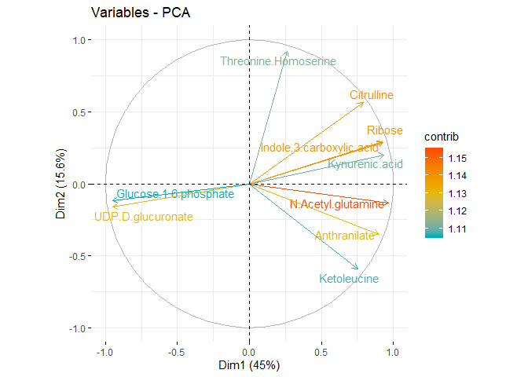

    ## [[1]]

    ## 
    ## [[2]]

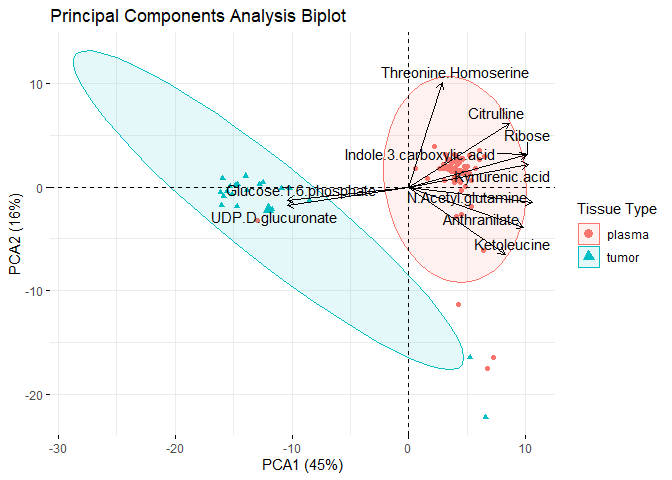

Plasma D7 vs D21 vs D35
-----------------------

This data fits the PCA poorly; the first 6 dimensions only explain about 64% of the data (although this could be partially due to the large number of variables). However, the scree plot shows a large "elbow" between Dim2 and Dim3, so looking at the first two dimensions is sufficient. The top contributing metabolites are Citrulline, Trehalose-6-phosphate, 2-keto-D-gluconate, Hydroxyphenylacetic acid, and Threonine Homoserine.

The Time groups cluster all together, indicating that there is not a clear distinction between metabolic communities over time.

    ## 
    ##  printing top eigenvalues... 
    ## 
    ##       eigenvalue variance.percent cumulative.variance.percent
    ## Dim.1  32.044451        23.562097                    23.56210
    ## Dim.2  24.906474        18.313584                    41.87568
    ## Dim.3  12.189812         8.963097                    50.83878
    ## Dim.4   7.577059         5.571367                    56.41014
    ## Dim.5   6.519990         4.794110                    61.20425
    ## Dim.6   4.975125         3.658180                    64.86243
    ## [[1]]

    ## 
    ## [[2]]

    ## 
    ## [[3]]

    ## 
    ## [[4]]

    ## 
    ## [[5]]

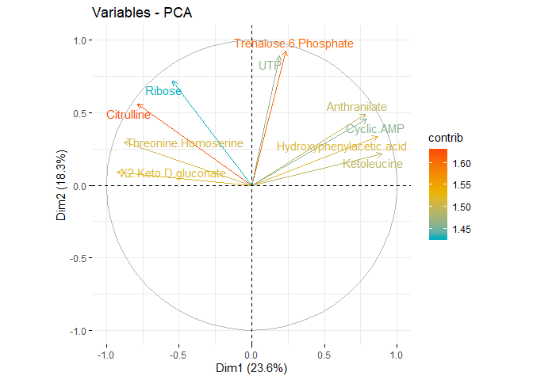

    ## [[1]]

    ## 
    ## [[2]]

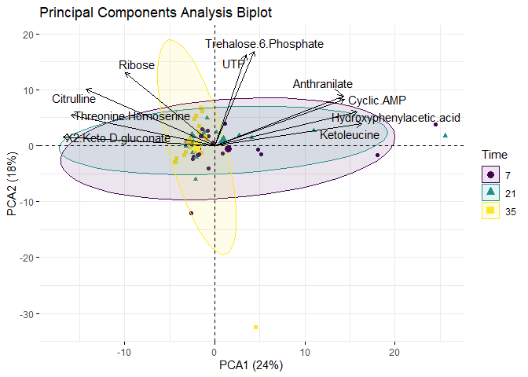

Tumor
-----

The scree plot shows a sharp decline between Dim1 and Dim2, as well as Dim2 and Dim3. The top contributing metabolites are Lactate, Phenylalanine, UDP-D-glucose, Ketoleucine, and Glutathione disulfide. The correlation plots show a clear distinction between groups of metabolites that cluster together.

The diagnostic plots show the PCA performed on the entire tumor dataset; there is no grouping variable involved.

    ## 
    ##  printing top eigenvalues... 
    ## 
    ##       eigenvalue variance.percent cumulative.variance.percent
    ## Dim.1  67.355104        49.525812                    49.52581
    ## Dim.2  16.525863        12.151370                    61.67718
    ## Dim.3   7.649706         5.624784                    67.30197
    ## Dim.4   7.049635         5.183555                    72.48552
    ## Dim.5   6.506481         4.784177                    77.26970
    ## Dim.6   5.103805         3.752798                    81.02250
    ## [[1]]

    ## 
    ## [[2]]

    ## 
    ## [[3]]

    ## 
    ## [[4]]

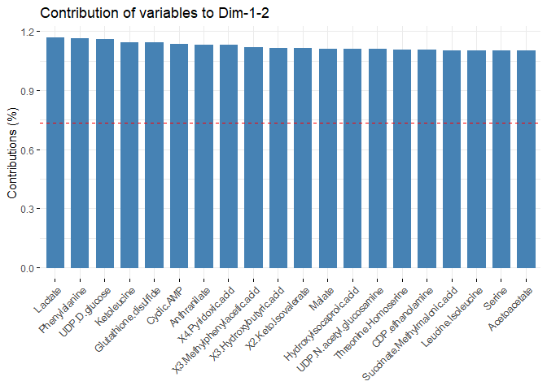

    ## 
    ## [[5]]

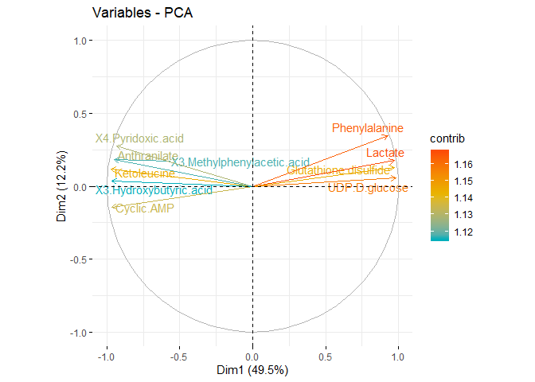

### Four Treatment Groups (2x2 factorial)

The 95% confidence intervals are very wide. Additionally, the correlating metabolites have short arrows, indicating a weak correlation. However, it seems that EX\_ER and SED\_ER are more tightly clustered than EX\_AL and SED\_AL.

    ## [[1]]

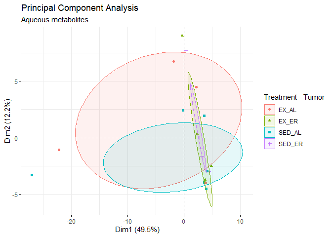

    ## 
    ## [[2]]

### Exercise vs. Sedentary

The data is clustered together in a line with no apparent pattern.

    ## [[1]]

    ## 
    ## [[2]]

### Weight gain vs. weight maintenance

In this group there is a tighter clustering in the ER group compared to the AL group.

    ## [[1]]

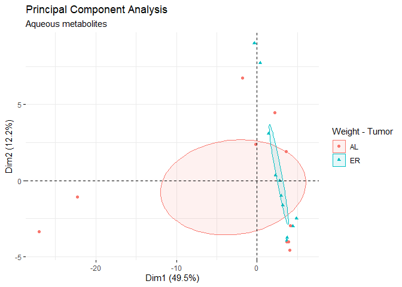

    ## 
    ## [[2]]

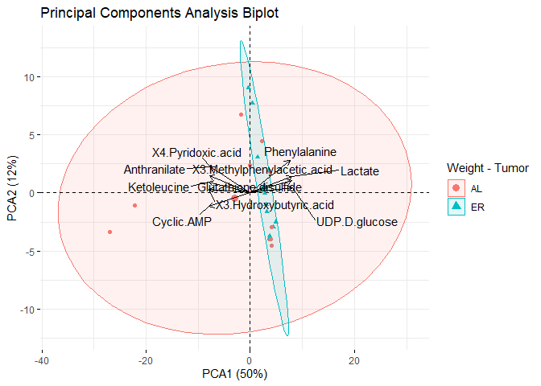

Plasma
------

There is also a fairly low percentage of variance explained by the top 6 eigenvalues (64% cumulative). The scree plot shows a sharp elbow between Dim2 and Dim3, so there is still a higher amount of variance explained by the first 2 axes. The top contributing metabolites are Citrulline, Trehalose-6-phosphate, 2-keto-D-gluconate, Hydroxyphenylacetic acid, and Threonine homoserine. Similarly to the tumor tissue, the plasma correlation plots seem to strongly cluster.

    ## 
    ##  printing top eigenvalues... 
    ## 
    ##       eigenvalue variance.percent cumulative.variance.percent
    ## Dim.1  32.044451        23.562097                    23.56210
    ## Dim.2  24.906474        18.313584                    41.87568
    ## Dim.3  12.189812         8.963097                    50.83878
    ## Dim.4   7.577059         5.571367                    56.41014
    ## Dim.5   6.519990         4.794110                    61.20425
    ## Dim.6   4.975125         3.658180                    64.86243
    ## [[1]]

    ## 
    ## [[2]]

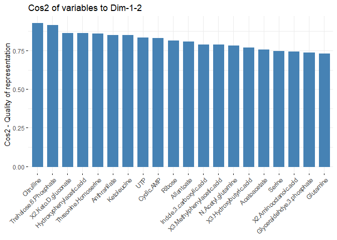

    ## 
    ## [[3]]

    ## 
    ## [[4]]

    ## 
    ## [[5]]

### Four Treatment Groups (2x2 factorial)

The arrows on the biplot are longer than the arrows in the tissue tumor, indicating a stronger correlation between the clusters and the top contributing metabolites. There is no clear pattern to the data.

    ## [[1]]

    ## 
    ## [[2]]

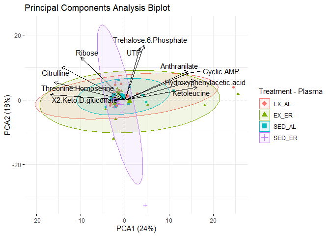

### Exercise vs. Sedentary

The first PCA plot shows that there are some samples with wide variance, notably most are in the Exercise group.

    ## [[1]]

    ## 
    ## [[2]]

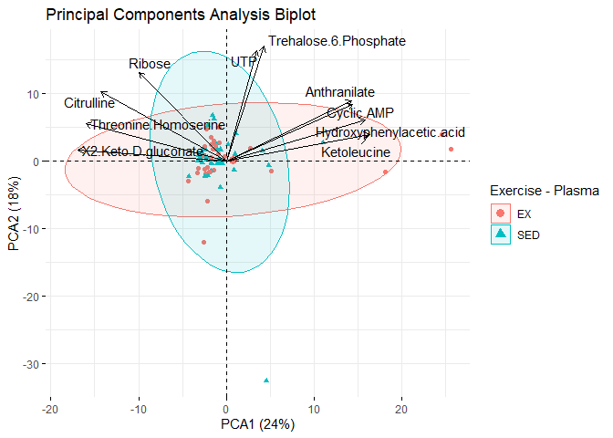

### Weight gain vs. weight maintenance

There is also no clear pattern to this data.

    ## [[1]]

    ## 
    ## [[2]]

